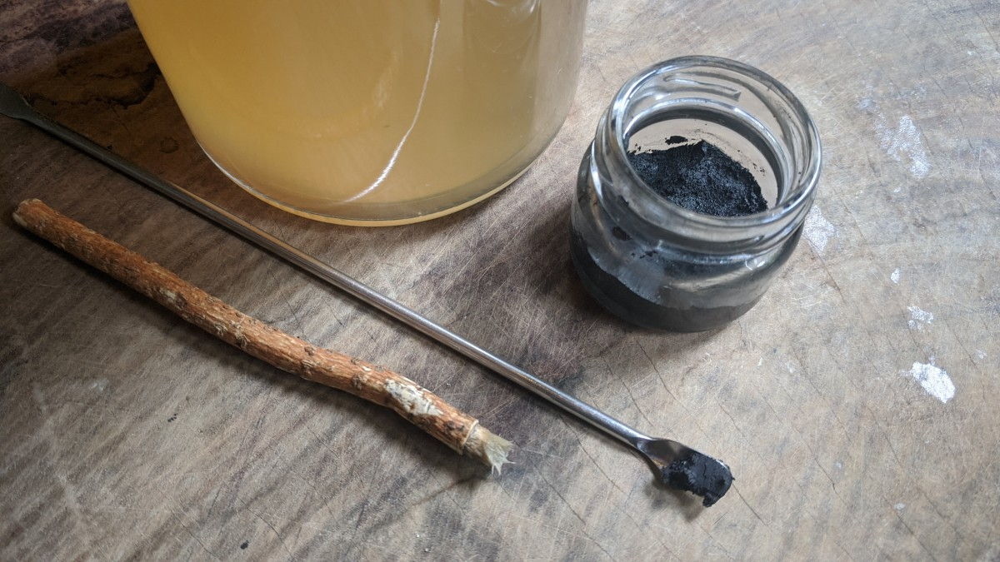

# Body Alchemy

*A personal record of using fermented plant essences for skin, hair, oral care, and wound healing.*

*The ferment is made as described in [Water Alchemy](water-alchemy.md). This document covers what the ferment becomes when it is turned toward the body.*

---

---

## An Ancient Practice

Women have been using fermented preparations on their bodies for as long as fermentation has been known.

**Cleopatra** bathed in sour donkey milk — documented by Pliny the Elder in his *Natural History*, and referenced in the Ebers Papyrus from 1550 BCE as one of the earliest recorded chemical peeling practices. Sour milk is fermented milk: lactic acid bacteria have lowered its pH and converted the lactose into lactic acid. What Cleopatra was bathing in, understood as such or not, was an alpha-hydroxy acid treatment — gentle chemical exfoliation, brightening, sustained hydration. The practice of sour milk baths appeared independently across Egyptian, Greek, and Northern European cultures, always for the same observed result.

**The court ladies of Heian Japan (794–1185 CE)** maintained floor-length black hair — called *kurokami* — through a practice called *yu-su-ru*: washing with the water left over from rinsing rice. The tradition was standard among court ladies and later among geishas, and was considered essential to the character of their hair. Modern analysis explains why: fermented rice water contains ferulic acid (a potent antioxidant that reduces UV-induced photoaging), inositol (which penetrates the hair shaft and stimulates fibroblast activity), and a complex of amino acids and B vitamins. Fermentation drops the pH of the water from neutral to skin-compatible, increases the bioavailability of all these compounds, and adds lactic acid and enzymes. The fermentation enhancement has been documented to increase the brightening potential of rice water by up to 48% compared to unfermented.

**The sake brewery workers of Japan** — the *toji* and the women who packed sake lees (*kasu*) into bags — were known for having unusually smooth, youthful skin on their hands well into old age, despite working in damp brewing environments. The Kobayashi Sake Brewery is specifically documented as having observed this phenomenon, which eventually led to the *sake skin* tradition in Japanese cosmetics. Sake kasu contains kojic acid (a tyrosinase inhibitor that reduces melanin production), alpha-arbutin (another melanin inhibitor working through a different mechanism), amino acids, ferulic acid, vitamin B complex, and vitamin E — all concentrated through the fermentation of rice.

**Yang Guifei**, the Tang Dynasty consort of Emperor Xuanzong and one of the Four Beauties of ancient China, is documented in court records as bathing at the Huaqing mineral springs and using botanical concentrates refined by the Tang court. The dynasty's sophisticated fermentation knowledge — the Tang period saw over 20 documented vinegar-making techniques — was applied to cosmetics: white face powder of the era was produced by exposing lead to vinegar, and the broader alchemical culture of the court included fermented botanical preparations.

**Korean court ladies of the Goryeo Dynasty (918–1392 CE)** are documented in historical texts as using fermented rice water and fruit extracts to maintain luminous skin. This tradition evolved continuously through the Joseon Dynasty and into the modern K-beauty movement — galactomyces ferment filtrate, derived from sake yeast fermentation, is now one of the most clinically studied actives in cosmetic science.

**Fermentation is the oldest documented skincare technology.** The principle is the same across all of these traditions: living organisms, given time with sugar and plant matter, produce a complex of acids, enzymes, vitamins, and metabolites that the skin knows how to receive.

---

## Why Fermentation Works on Skin

### The Acid Mantle

The skin's surface is protected by a thin film called the acid mantle — maintained at a pH of approximately 4.5 to 5.5 by sebum, sweat, and the metabolic activity of the skin's resident bacteria.

This mantle is the first line of defence. At acidic pH, *Staphylococcus aureus* and other pathogens are held in check while beneficial organisms like *Staphylococcus epidermidis* thrive. The acidity supports ceramidase activity — which peaks at pH 5.5 — enabling the lipid processing essential for barrier function. Antimicrobial peptides (AMPs), the skin's own defensive compounds, are enhanced and more effective in an acidic environment.

Conventional soap is alkaline — typically pH 9 to 10. Every wash strips the acid mantle and raises skin pH measurably. The skin can take up to 30 minutes to rebalance. Over time, repeated disruption impairs the barrier, increases transepidermal water loss, and creates conditions that favour pathogen colonisation.

Fermented essences sit at pH 3 to 5 — within and just below the mantle's range. They clean by acidity and enzyme action, not by stripping. When the wash is over, the skin's pH has been supported rather than disrupted.

### Postbiotics

*Postbiotics* are the non-living byproducts of microbial metabolism: what the bacteria and yeasts produce and leave behind during fermentation. This includes organic acids (lactic, acetic, citric), enzymes, peptides, short-chain fatty acids, vitamins, bacteriocins, and exopolysaccharides like kefiran.

For skin, postbiotics are often more practical than live probiotics. Live organisms applied to skin do not colonise or persist — the surface environment does not support them. Postbiotics are structurally stable, do not require special storage, and show visible results within one to two weeks. The lactic acid continues exfoliating. The peptides continue signalling tissue regeneration. The bacteriocins continue competing with pathogens. Whether the organism that produced them is still alive is irrelevant.

A well-fermented essence contains a web of these compounds working together — not a single isolated active.

### What LAB Fermentation Produces for Skin

**Lactic acid** — an alpha-hydroxy acid (AHA). LAB fermentation produces L(+)-lactic acid specifically — the natural configuration. Synthetic lactic acid is a racemic mixture of both isomers. The mechanism: loosens bonds between dead skin cells in the outermost layer, accelerating their shedding without physical abrasion. Also a humectant: attracts and holds moisture at the skin surface. Stimulates collagen synthesis in the dermis with prolonged use.

**Lipoteichoic acid** — produced from LAB cell walls as fermentation proceeds. Inhibits the enzyme tyrosinase, reducing melanin production. Documented to have anti-photoaging effects on human skin cells and to suppress the matrix metalloproteinase-1 (MMP-1) that would otherwise break down collagen. This is not present in synthetic lactic acid preparations — it is specific to living fermentation.

**Alpha-hydroxy acids generally** — fermentation of citrus matter produces glycolic acid and malic acid alongside lactic acid. Together they exfoliate across a range of molecular sizes and penetration depths.

**Amino acids and peptides** — delivered in their smallest, most bioavailable form after fermentation has broken down the source material. The building blocks of collagen, elastin, and keratin.

**Enzymes** — proteases and lipases produced by the fermenting organisms digest dead cell debris and oxidised surface lipids. Bromelain from fermented pineapple peel is particularly studied for its antimicrobial activity (see oral care below).

**Vitamin B3 precursors** — present in ferments made with kefir whey or rice water. Converted to niacinamide in the skin: builds the ceramide barrier, locks in moisture, reduces redness, regulates sebum, increases collagen. Clinically validated; here present in its naturally produced form.

**Antioxidants** — ferulic acid and polyphenols from citrus and pineapple are concentrated and made more bioavailable through fermentation.

---

## The Three Components

At harvest, the ferment yields three distinct materials:

**1. The clear liquid essence** — the filtered, settled liquid. Lightest and most versatile. Used directly as a toner, wash, rinse, or as the base for blended products.

**2. The paste or sediment** — what settles after filtering. Denser, more concentrated. Used in masks, scrubs, and as a paste for wound care or oral hygiene.

**3. The solid filtrate** — the spent plant matter after straining. Still active, still probiotic. Used as a mask blended with clay, a body scrub with coffee grounds, or directly in the bokashi bin. Keep pieces small enough to flow down the drain, or place a screen over the drain.

All three are viable. Each suits different applications.

---

## Application: Body and Hair

This is not soap. It will not lather. It will not strip.

**Body wash — shower method:**

Dampen the skin. Turn off the water. Apply the clear essence from a spray bottle, a repurposed shampoo bottle, or poured from a bowl — enough to wet the entire surface from neck to feet. Using a body cloth or soft brush, work the essence into the skin in upward strokes from hands and feet toward the heart. Take time with it. Give the essence contact time before rinsing. Turn the water back on and rinse.

**Body wash — bath:**

Add the essence to the bath water — as much as desired. The bath becomes an acidic soak: long contact time, sustained pH shift, enzyme and postbiotic action across the entire surface. The same principle as Cleopatra's fermented milk baths, made from whatever the kitchen produced.

**Hair:**

Dampen the hair. Apply clear essence from a spray bottle or bottle directly onto the scalp and hair. Massage into the scalp. Leave as long as desired. Rinsing is optional — the residual acidity closes the hair cuticle. Over time, consistent use shifts the scalp's microbial environment. The yu-su-ru tradition ran unbroken for centuries in Japan on the same principle.

The essence can be combined with a small amount of existing shampoo or body wash — roughly 30ml of manufactured product to 1 litre of essence — as a gradual transition away from conventional products.

---

## Facial Care

**Toner:** Pure clear essence applied with a cloth or cotton pad, full strength or diluted 1:1 with clean water. The simplest and most consistent daily use.

**Makeup remover:** Essence blended with a facial oil — almond, moringa, or coconut — and optionally a small amount of clear alcohol. The oil lifts the pigment; the essence acidifies and cleanses.

**Facial mask:** Any of the three components, used alone or blended. The paste or sediment applied directly to the face, left to dry or massaged in and rinsed. Combined with powdered clay or powdered herbal mask, the essence becomes the activating liquid. Used at full strength.

**Dilution ratios for reference:**

| Use | Ratio |
|---|---|
| Body wash | 1:10 (essence:water) or with a little liquid soap |
| Hair rinse | 1:50 to 1:100 |
| Facial toner | full strength or 1:1 |
| Makeup remover | essence + facial oil + small amount of alcohol |
| Facial mask | full strength |

---

## Body Scrub

Mixing dried spent coffee grounds with the paste or sediment essence is the scrub used most in this practice — for face and for the whole body. The coffee grounds provide physical exfoliation; the fermented paste provides chemical exfoliation and deep moisture. Effective without being harsh.

As a foot soak, the paste essence softens callused skin. Add clear essence or paste to a foot bath, soak, then brush and trim as usual.

---

## Wound Care and Intimate Use

Fermented essences in the pH 4–5 range are appropriate for the most sensitive areas of the body. This range mirrors the pH of healthy vaginal tissue (approximately 3.8–4.5) and supports rather than disrupts the microbial community there.

Vaginal pH fluctuates with hormonal changes, antibiotic use, new sexual partners, and other factors. These fluctuations create the conditions for bacterial vaginosis (overgrowth of bacteria) and yeast infections (Candida overgrowth). A consistently acidic wash — one that supports rather than strips the existing flora — works with the terrain rather than treating it as a problem to be solved.

For wound care — cuts, burns, abrasions, fungal infections — the diluted essence (1:10) works as a wash. The undiluted paste can be applied directly. For warts and fungal infections, full strength and undiluted.

This is recorded as personal observation only.

---

## Oral Care

Citrus and pineapple ferments are particularly active for oral use. The bromelain derived from fermented pineapple peel has been documented to be effective against *Enterococcus faecalis* — a common oral pathogen associated with root canal treatment failure, urinary tract infections, and hospital-acquired infection — by disrupting the peptidoglycan and polysaccharide components of the bacterial cell membrane.

*E. faecalis* produces biofilm that conventional antiseptic rinses penetrate with difficulty. The enzymatic activity of a mature citrus or pineapple ferment works through a different mechanism than chemical antiseptics — which is part of why it is effective against antibiotic-resistant strains.

**Mouthwash:** Rinse with full strength clear essence, or diluted 1:1 with water. Adding 100ml of clear alcohol (sake works well) to 1 litre of essence extends shelf life and adds its own antimicrobial action.

**Brushing:** Rinse first with essence. Sip a small amount, begin brushing as normal with essence rather than toothpaste. The paste or sediment can be used directly on the brush. Rinse with essence or water when done.

---

## The Tooth Powder

After years of experimenting, a formula emerged that actually works — used in combination with the fermented essence, not as a replacement for it.

The powder provides mineral and physical cleaning action. The essence provides probiotic and pH-correcting action. Both at the same time.

**What's in it:**

- Moringa oil — just enough to bring the powder together while keeping it crumbly; added by the drop
- Activated charcoal — 1 tsp
- Bentonite clay — 1 tbsp (adjust to preference)
- Organic eggshell, finely powdered — 1/8 tsp
- Sodium bicarbonate — 1 tsp (optional)

**Optional essential oils:**
- Myrrh oil — 5 drops
- Oregano oil — 5 drops
- Clove oil — 5 drops

**To make:** Blend the essential oils into a small amount of moringa oil first. Add that blend by dropper to the dry powders. Finish with pure moringa oil to bring the mixture to a crumbly consistency — it should hold together slightly but not be wet. Keep it dry enough to blend with essence paste or clear essence at the moment of use.

The sensation after using this combination: like leaving the dentist after a cleaning.

---

## A Note on Transition

There is a period of adjustment when moving from commercial body care to fermented essences. The skin's flora recalibrates. Things may feel different — drier, or oilier — while the balance shifts. This is not the ferment failing. It is the skin returning to its own regulation.

The mantle restores. The microbiome stabilises. The skin finds its own rhythm without external correction.

*This is a personal record of ongoing practice. Nothing here is instruction.*

---

*Continue reading: [Water Alchemy — Fermented Tonics →](water-alchemy.md)*

*[← Back to Index](README.md)*
