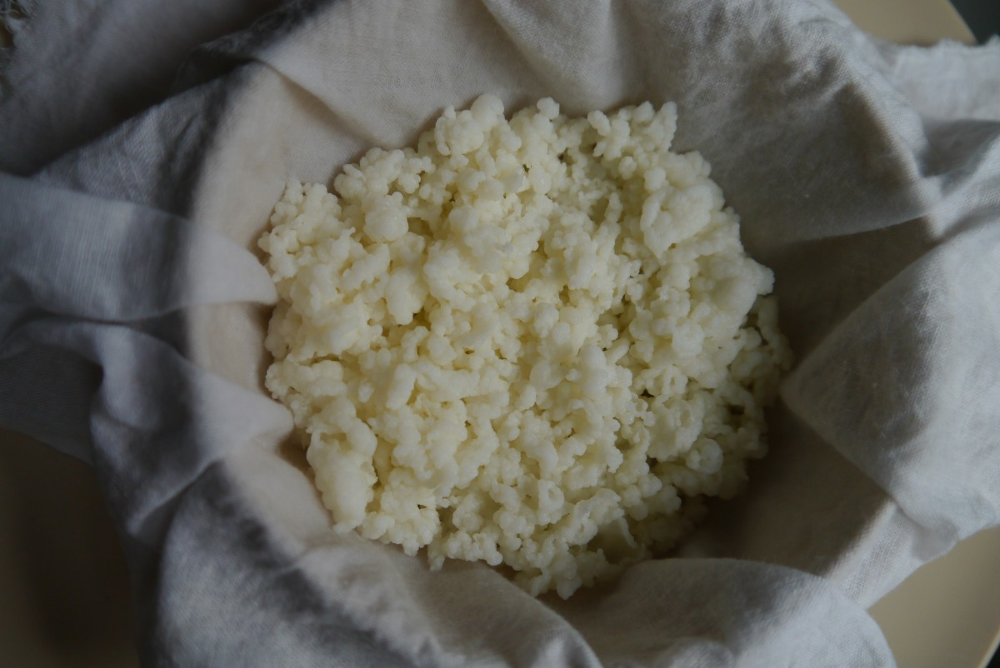
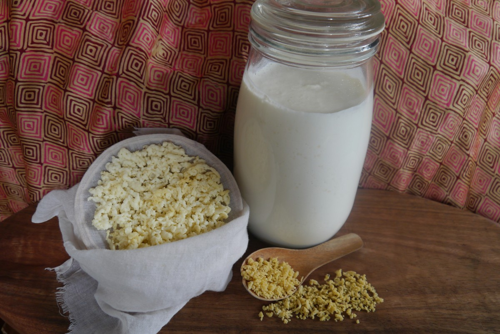
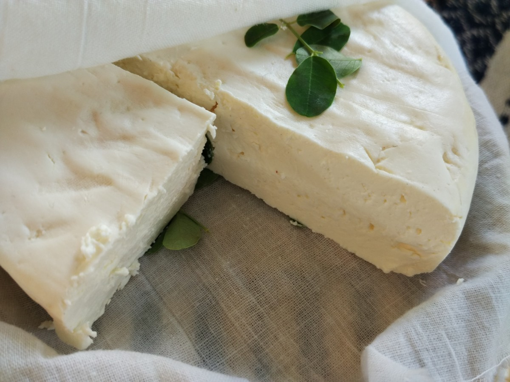
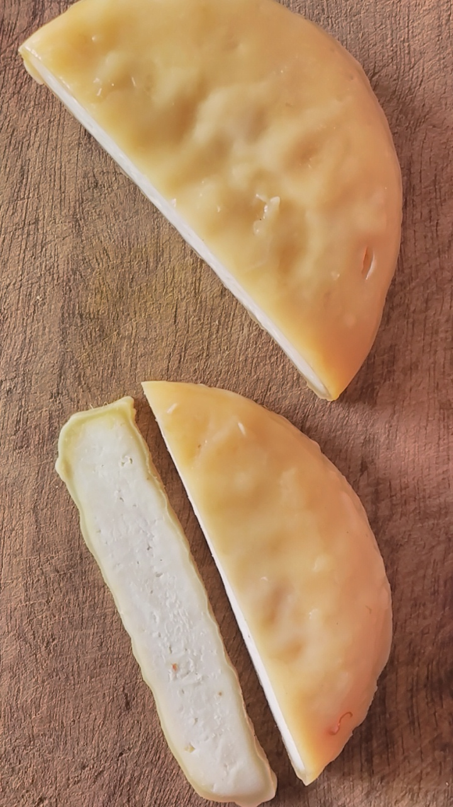
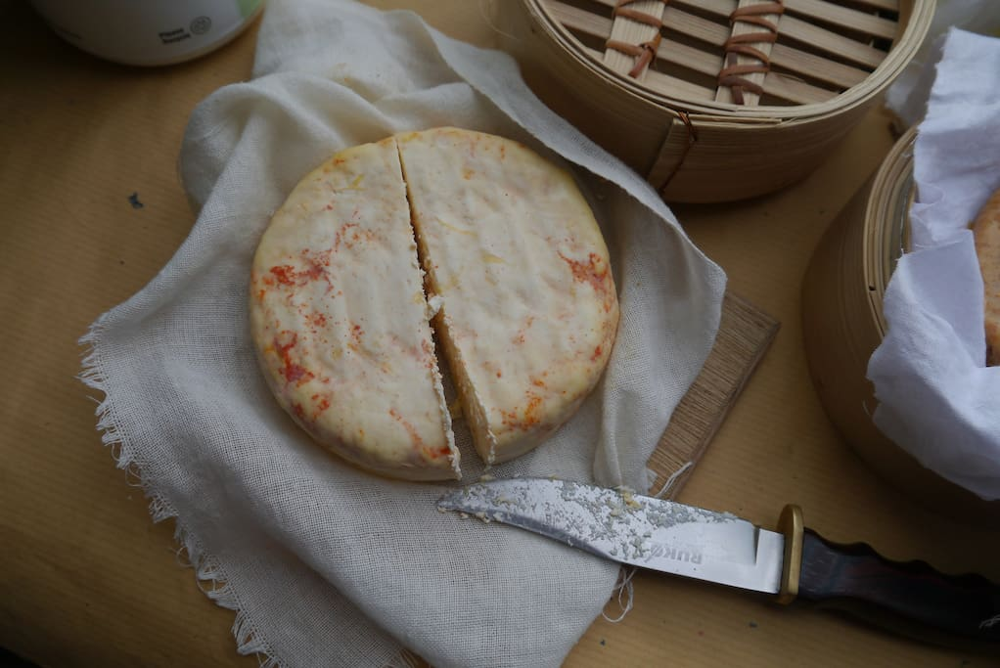
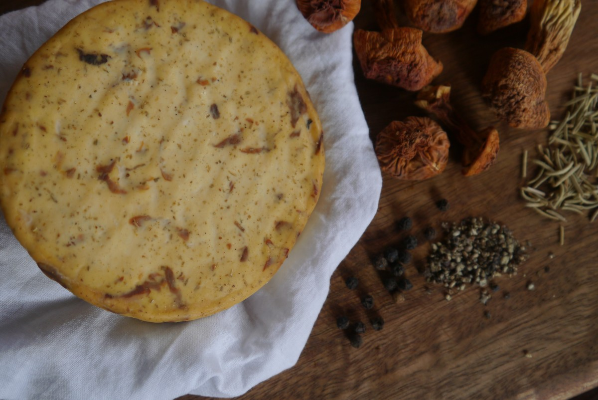

# Kefir Alchemy

*A personal record of culturing milk kefir — the living grain, the daily cycle, the cheese.*

---

---

## What Kefir Is

Kefir is fermented milk. Not yogurt — something older and more complex.

The fermenting agent is a kefir grain: a soft, gelatinous cluster of bacteria and wild yeasts that have evolved into a symbiotic entity. The grain produces the ferment, the ferment feeds the grain, and the grain grows. Given adequate milk and tolerable conditions, a healthy grain culture is theoretically indefinite. These are living descendants of mother cultures carried across the Caucasus region for centuries — traded among people, passed between families, kept alive through continuous use.

The dominant organisms are *Lactobacillus caucasicus*, *Leuconostoc* species, lactic streptococci, *Saccharomyces kefir*, and *Torula kefir*, among others. A mature grain culture carries 30 or more distinct strains of bacteria and yeasts working in symbiosis — far beyond what any commercial ferment standardises to. One compound unique to kefir — an insoluble polysaccharide called *kefiran*, produced by the grains themselves — is antimicrobial, antifungal, shown to help fight candida, and has demonstrated the ability to lower cholesterol and blood pressure.

The name comes from the Turkish *keif*: good feeling. In Tibetan culture it is called Tara, from the Sanskrit for star — a symbol of the light of the soul. It has also been called the champagne of milks, because a well-made kefir is effervescent, lightly alcoholic (anywhere from a fraction of a percent to 3%, depending on fermentation length), and produces a drink thicker than milk ranging from mildly tart to deeply sour.

**Before refrigeration, there was kefir.** Properly cultured and stored, kefir milk remains safe to consume for over a year without cold storage. Kefir cheese can be aged nearly indefinitely.

---

## The Living Grain

Kefir grains are biological structures — not a powder, not a capsule, not something manufactured. Science cannot recreate them from component organisms. They evolved through spontaneous symbiosis and they self-reproduce. The grain is the culture, not a delivery mechanism for it.

Grains vary considerably in appearance: some grow as small irregular clusters, some into clumps of several inches, some spread out like a sheet. The variation is natural — the same way all biological structures exhibit individual expression. What they share is the soft, gelatinous texture and the capacity to ferment milk into kefir reliably, continuously, when given what they need.

Kefir can be cultured from any animal milk — cow, goat, sheep, buffalo, camel, mare, even human milk. Grain growth and full probiotic expression require animal milk. The grains can also ferment nut milks, coconut water, and herbal teas, but they will not grow in these — they are a different kind of ferment in that medium, and the medicinal profile differs.

---

## History and Lineage

Kefir's origins are in the Caucasus mountain region — present-day Georgia, Armenia, Azerbaijan, and the surrounding areas. The people of the Caucasus have one of the highest rates of longevity in the world, and kefir has been part of their food culture for as long as anyone can trace.

For centuries, kefir grains were closely held. Traditions around the grains included specific practices for their care and strong cultural ideas about sharing them with outsiders. The grains moved between families and communities as gifts and trade goods, carried in cloth or dried for transport. They arrived in wider use largely through the interest of early 20th-century scientists who recognised the connection between the Caucasian diet and the health of its people.

Traditional kefir was made in leather bags — goatskin, usually — hung near a doorway where anyone passing would knock the bag and keep the fermenting milk and grains in constant gentle motion.

---

## What Kefir Contains

The composition of home-fermented kefir is not standardised — it varies with the milk used, the grain culture, the fermentation time, and the temperature. This is not a limitation. It is the nature of living ferments.

**Vitamins:** A, K, B1, B2, B3, B5, B6, B12, C, folic acid, carotene.

**Minerals:** calcium, magnesium, phosphorus, zinc, copper, manganese, iron, cobalt, molybdenum.

**Amino acids:** serine, lysine, alanine, threonine, tryptophan, valine, methionine, phenylalanine, isoleucine, and others — the essential amino acids in abundant form, partially pre-digested by the fermentation process and therefore easier for the body to absorb.

**Kefiran:** the exopolysaccharide unique to kefir. Antimicrobial, antifungal, shown to support wound healing, connective tissue integrity, and immune modulation. Present in no other ferment.

Even accounting for the variability, home-fermented kefir consistently outranks commercial varieties in live culture count and diversity.

---

## Method: Culturing Milk Kefir

**What is needed for 2 cups of kefir:**

- 1–2 tablespoons kefir grains
- 2 cups fresh whole milk (raw, unpasteurised, or pasteurised — not UHT)
- A 3–4 cup glass jar with a lid
- A strainer (nylon, bamboo, or stainless steel — holes no larger than 2mm)
- A wide bowl

**1. Place grains in the clean jar. Add fresh milk.**

For sterile jars and hands, rinse with a splash of fermented enzyme or vinegar — not with antibacterial soap, which can damage the grains.

**2. Stir gently and cover.**

Ferment at room temperature for approximately 24 hours, or until the kefir reaches the sourness and thickness preferred. Shorter fermentation produces a milder, thinner kefir. Longer produces more sourness and carbonation. A sealed lid produces light effervescence; a cloth cover allows a more aerobic, milder ferment.

The fermenting temperature matters. Warmer means faster. Cooler slows the process and can shift the balance between bacteria and yeasts. Consistent ambient temperature produces more consistent results.

**3. Strain.**

Stir or shake to even consistency. Pour through the strainer into the wide bowl. Use a spoon to gently encourage the kefir through — do not press the grains into the strainer. The liquid kefir drops through; the grains stay.

**4. Store the kefir milk.**

Into a clean sealed bottle. Can be consumed immediately or stored for 1–2 days in the refrigerator — the flavour continues to develop, and vitamins B1, B6, and B9 (folic acid) increase during storage. At room temperature, flavour continues to ripen without refrigeration.

**5. Return the grains and repeat.**

Place the strained grains back into a clean fermenting vessel with fresh milk. Do not rinse the grains between batches — washing them removes the culture residue that is part of the next ferment. Repeat.

---

## Managing the Grain Culture

Kefir grains grow as the culture is maintained. As they multiply, the ratio of grains to milk shifts and fermentation accelerates — if left unchecked, over-fermentation produces a product that is too sour and the grains begin to crowd themselves.

When the volume of grains has grown noticeably, remove a portion. Options:
- Eat them — grains are edible, mildly sour, and nutritious
- Dehydrate them for storage or sharing: spread on a clean surface, allow to air-dry at room temperature until brittle, store dry in a sealed container (this is the traditional way grains were transported)
- Blend dried grains with herbs and spices for a probiotic condiment
- Pass them on

The ongoing practice is one of constant return: daily or near-daily, the jar is opened, the kefir strained, fresh milk added. Culturing kefir requires cycles — to return to, to inspect, to refresh and renew.

---

## Kefir Cheese

Kefir cheese is made by straining the liquid kefir further — through a cloth bag or layered muslin, hung to drain for 12–24 hours — until the whey has separated out and the remaining curd has reached the desired consistency. The longer it drains, the firmer the result.

The fresh cheese is mild, soft, and slightly tangy. It can be eaten as-is, blended with herbs, pressed into a firmer form, or aged.

Adding aromatics, spices, and botanicals during the draining or pressing stage produces an enormous range of flavours. Saffron. Durian. Almond, mushroom, rosemary, black pepper.

Kefir cheese aged in a cool, well-ventilated space continues to develop complexity over weeks or months. It is one of the oldest forms of cheese — made from a living culture, not from standardised starter packets, and different every time.

---

## The Whey

Straining kefir produces two things: the cheese (or thickened kefir) and the whey — the clear, slightly golden liquid that drains off.

Kefir whey is not a byproduct. It contains a large portion of the culture's B vitamins, amino acids, and live organisms. It is highly bioavailable.

**As a bokashi starter:** a small amount of kefir whey can replace the rice water serum in the [soil alchemy process](soil-alchemy.md). It carries the same lactic acid bacteria directly, without the intermediate fermentation step.

**As a ferment starter for body care:** kefir whey added to a batch of [water alchemy ferment](water-alchemy.md) or used as the inoculating liquid for a body care essence batch introduces the same culture. The skin care connection — niacinamide precursors and kefiran derivatives — is direct.

**Diluted and consumed:** whey diluted with water makes a light, mildly sour tonic. High in protein, electrolytes, and live culture.

**For bread:** a splash of kefir whey in bread dough or pancake batter adds leavening activity, flavour, and the nutritional profile of the culture.

---

## A Note on This Practice

Kefir grains are not ingredients. They are a culture — a living community with a lineage. The practice of culturing them is a relationship with continuity: the same grains, fed and strained and returned, producing something different each time while remaining recognisably themselves.

The beauty is in the dailiness of it. Not a project but a rhythm.

*This is a personal record of ongoing practice. Nothing here is instruction.*

---

*Continue reading: [Body Alchemy — Fermented Skin and Oral Care →](body-alchemy.md)*

*[← Back to Index](README.md)*
