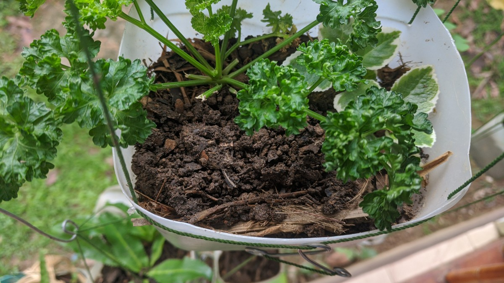
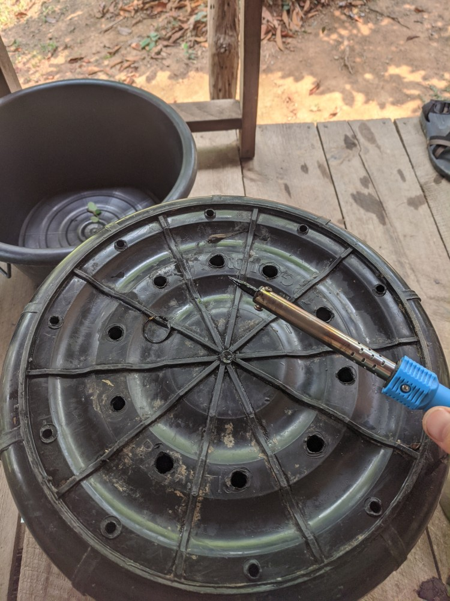
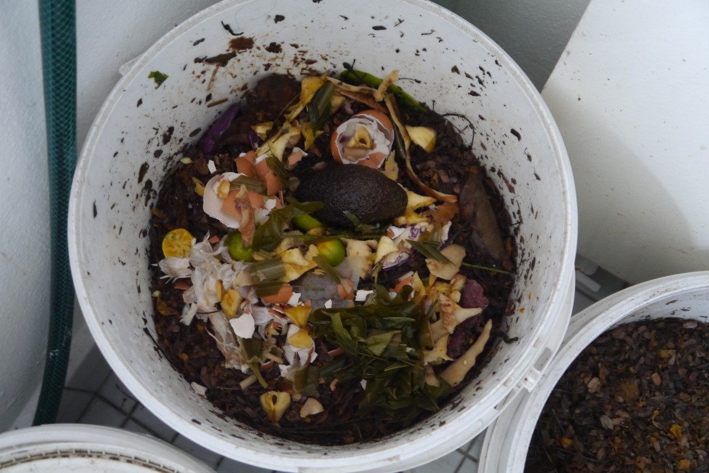
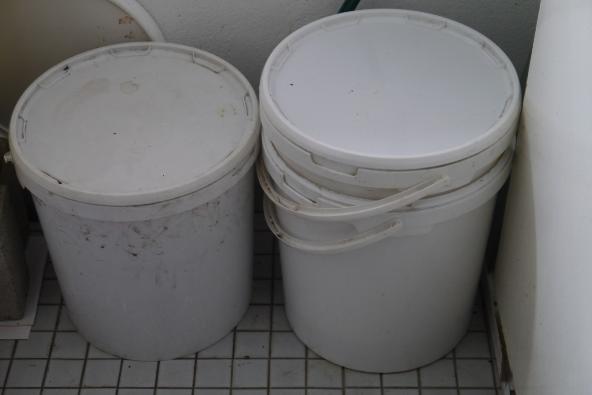
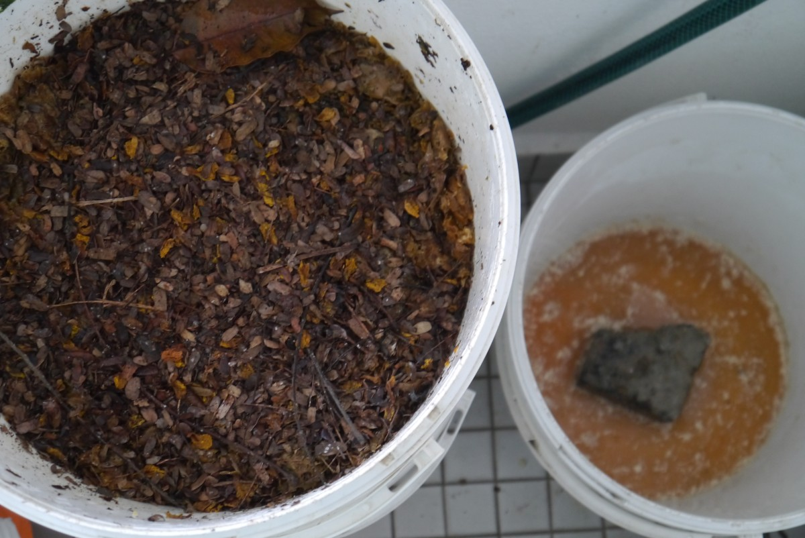
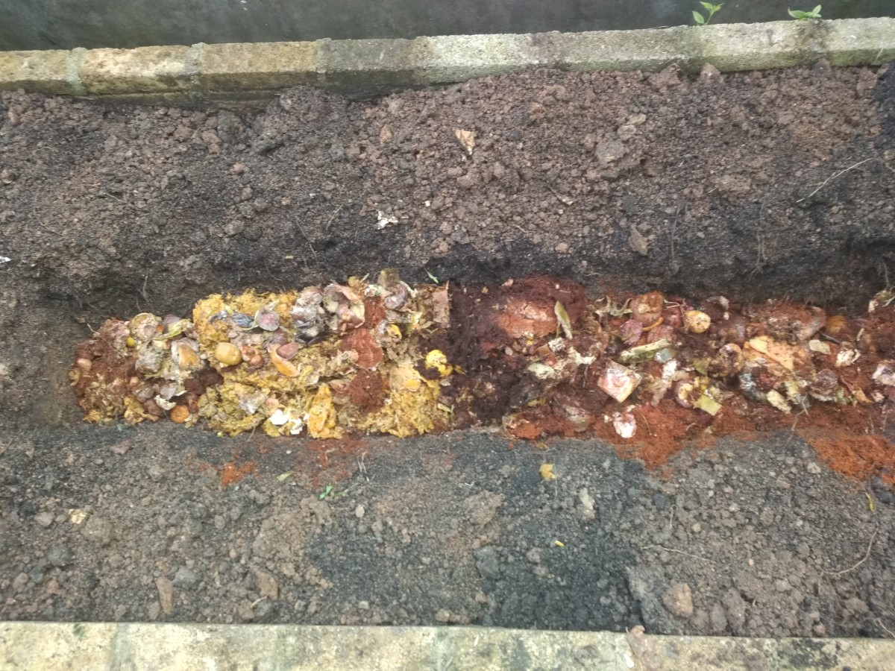
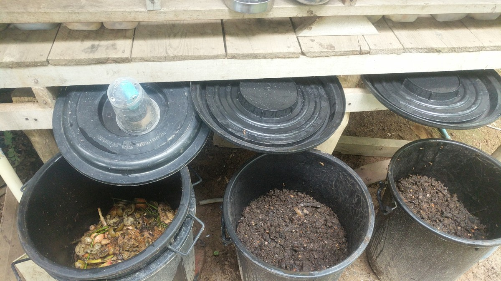
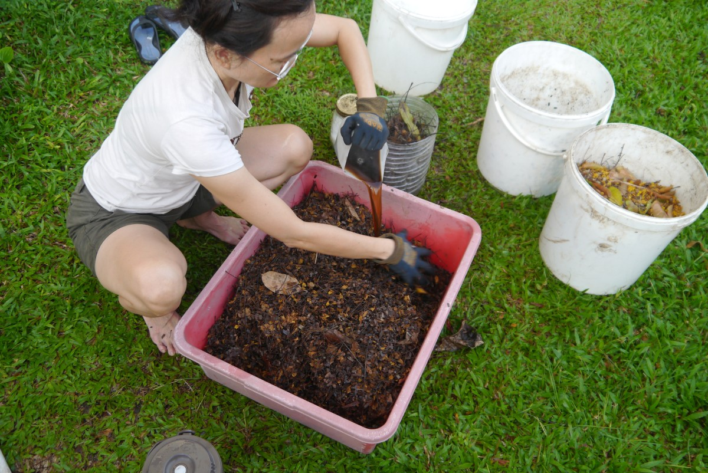

# Soil Alchemy

*A personal record of indoor fermentation for year-round probiotic soil building — and what happened when the black soldier flies arrived.*

---

---

## Where This Began

*Bokashi* is a Japanese term for fermented organic matter. As a practice, it is an indoor, anaerobic method for processing food remnants into a pre-digested soil amendment — using lactic acid bacteria and other effective microorganisms rather than heat and oxygen.

The distinction from conventional composting is fermentation. No heat is generated. No turning is required. No methane is produced. The process is sealed and quiet. What comes out of the bin after two weeks is not compost — it is a pre-composted, acidic, probiotic material that, when buried in soil, breaks down within days and feeds the microbial community directly.

What is documented here is what that practice became. The bokashi system was always intentional. What the black soldier flies brought to it was not planned — it arrived, it worked, and the system grew around what they offered.

---

## Why This

The kitchen generates organic matter continuously. That matter can return to the soil it came from, or it can go to landfill.

Bokashi closes that loop indoors, year-round, without a garden. The fermented material can be buried in a pot, added to a compost pile, or carried to a patch of ground.

It processes most food remnants — including cooked food, meat, dairy, fish, bones — that conventional composting cannot handle safely. This made it the right system for a kitchen without a garden, in a climate where organic matter accumulates fast.

---

## Bokashi: The Fermentation Stage

**What is needed:**

- Two food-grade bins with tight-fitting lids, one nesting inside the other
- Bokashi starter mix (bran or other absorbent material inoculated with effective microorganisms)
- Food remnants, chopped small
- A brick or similar to raise the inner bin and create drainage space

Drill or melt 20–30 small holes in the bottom of one bin. Place the brick inside the solid bin. Set the holed bin inside it.

**Fermentation — 10 to 14 days:**

Layer food remnants in the inner bin. After each layer, dust with bokashi starter. Compact firmly and close the lid. Repeat as remnants accumulate.

When the bin is full, seal it completely and set it aside for 10–14 days. Start a second bin in the meantime.

A healthy bin smells slightly sour — like apple cider vinegar, perhaps a little alcoholic. Not offensive. A putrid smell means the seal has failed or the starter culture is weak.

**Bokashi tea:**

Liquid collects in the outer bin during fermentation. Drain it regularly. It is concentrated — dilute 1:100 with water before using on plants, or pour it down the drain.

**Soil incorporation:**

Bury the contents 15–20 cm deep in garden soil or a large pot. Up to a third of the volume can go directly into the bottom of pots. The material is acidic coming out — wait 10–14 days before planting into the amended area.

---

## Making Starter Mix at Home

The starter carries the culture: lactic acid bacteria, photosynthetic bacteria, and yeast distributed through a dry absorbent medium.

**Building the culture — rice water method:**

Soak rice 1:2 in water. Stir vigorously. Strain off the water into an open vessel. Cover with cloth and leave 5–8 days until lightly fermented and sour. Combine 1 part fermented rice water with 10 parts whole milk. Leave covered 10–14 days. The mixture separates — take the middle liquid layer. If layers do not form clearly, strain through fine mesh. This is the serum.

Alternatively: kefir whey or sauerkraut juice work directly as the same organisms.

**Inoculating the medium:**

- 50ml molasses
- 50ml serum
- 250ml warm water
- 5kg dry absorbent material — wheat bran, dried leaf, coconut coir, or shredded paper

A note on the medium: coarser material creates more air space and works better in practice. Sawdust, larger-cut bran, or rice husks allow better drainage and prevent the substrate from packing tight and going anaerobic. When black soldier fly larvae were present (see below), a coarser medium made the difference between larvae that moved freely and a bin that became soggy and stopped working.

Combine all liquids. Pour over the dry material and mix until it holds together when squeezed but no liquid runs out. Seal with as little air as possible. Ferment 10–14 days. Ready when it smells slightly sour and sweet — like apple cider vinegar. Not rotten.

---

## What Arrived: Black Soldier Fly Larvae

At some point during this practice — living in a villa, no direct garden access, running a closed fermentation system — the black soldier flies arrived on their own.

*Hermetia illucens*, the black soldier fly, is not a pest. It does not carry disease. Adult flies do not eat — their sole function in the final days of their lives is to mate and lay eggs. The larvae do all the work.

What they did to the bokashi system was not disrupt it. They accelerated it.

**What BSFL are:**

The larvae of *Hermetia illucens* are among the most efficient waste processors known. A single larva can consume up to twice its body weight daily. They work through cooked food, meat, dairy, fish, and fecal matter at a rate that conventional composting cannot approach. A complete processing cycle — food waste to mature larvae — takes 1 to 3 weeks under the right conditions.

Research has confirmed what this practice found: BSFL perform better on pre-fermented waste. Bokashi fermentation and black soldier fly larvae are complementary systems. The ferment that comes out of the bokashi bin is exactly what the larvae prefer to work with.

**The life cycle:**

- Eggs hatch in 3–4 days
- Larvae feed through 6 moults over 13–18 days, growing fast
- When ready to pupate, larvae darken, stop eating, and instinctively migrate upward and outward seeking dry ground — this migration can be redirected with a ramp into a collection vessel
- Pupal stage lasts 7–14 days
- Adult flies live 5–8 days, focused entirely on laying the next generation of eggs

**What they eat:**

Vegetables, fruit, cooked food, meat, dairy, bread, fats — and human fecal matter. A mixture of food waste and fecal matter works better than feces alone; the food waste improves pH balance and microbial composition. With two people's worth of kitchen waste and human fecal matter, there was never a backlog. The larvae kept pace throughout a full year of use in a closed system.

---

## The Setup: Three-Bin Rotation with BSFL

The system ran on small garbage cans — three bins in rotation. Two people, a closed villa environment, no garden access. Everything processed through the system, nothing leaving it.

**Inviting egg-laying:**

Black soldier flies lay their eggs in dark, narrow crevices — ridges, grooves, any corrugated surface. In research, corrugated plastic tubes receive more egg-laying visits than cardboard. The flexible accordion drain pipe — the corrugated plastic tube used under kitchen and bathroom sinks, with bends that can be shaped and reshaped — is ideal for this.

A length of flexible corrugated drain pipe was hung from the underside of the bin lid with wire, positioned so that when eggs hatched and the tiny neonate larvae dropped, they fell directly into the compost below. The flies found the ridges and deposited their eggs in the grooves. The hatchlings did not need to be moved.

A hole drilled through the top of the bin — large enough for the flies to enter, small enough to keep out rain — gave them access to the egg-laying substrate without opening the bin completely. The setup was contained and odour-controlled.

**Substrate and moisture:**

Coarser material in the bin — sawdust, larger bran, rice husk — is important once larvae are present. Fine bran packs tight and becomes waterlogged as the larvae work through it. Coarser material stays open, drains better, and gives the larvae room to move. A bin full of larvae that has gone soggy is harder to manage and produces less.

The egg-laying trap improves with time. Female BSF are attracted by the scent of previous egg-laying in the same spot. Once the groove has been used, it becomes more attractive to the next generation.

**Self-harvesting:**

When prepupae are ready to pupate, a biological switch triggers migration out of the food source. Their mouthparts transform into a crawling appendage. They darken significantly, stop eating, and climb. A ramp — any angled tube or surface leading from the top of the bin into a separate collection container — captures them without any sorting. They crawl up and out on their own.

The prepupae are high-protein feed for chickens, fish, and other animals. The frass — the residue left in the bin after the larvae have processed — is a nutrient-rich soil amendment, dark and granular, ready for direct garden use or further processing.

---

## On the Closed System

For a full year, two people's organic matter — kitchen waste and human fecal matter — was processed through this system inside a villa with no direct garden access.

Nothing left as waste. The BSFL managed the volume. The bokashi fermentation made the material easier for them to process. The frass accumulated and was periodically used on indoor plants or carried out.

What that year demonstrated is that the two systems together — bokashi and BSFL — can manage more than either system handles alone. Bokashi acidifies and pre-digests. BSFL convert. The outputs are frass for soil and prepupae for animal feed. The inputs are what would otherwise be discarded.

---

## The Connection to Water Alchemy

The [eco-enzyme ferment](water-alchemy.md) produces liquid and spent solids at harvest. The solids carry the same probiotic culture and organic acids. They go directly into the bokashi bin — or, when BSFL are present, into the active processing bin — as one of the richest inputs either system receives.

The loop has no waste point.

---

*This is a personal record of ongoing practice. Nothing here is instruction.*

---

*Continue reading: [Water Alchemy — Fermented Tonics →](water-alchemy.md)*

*[← Back to Index](README.md)*
