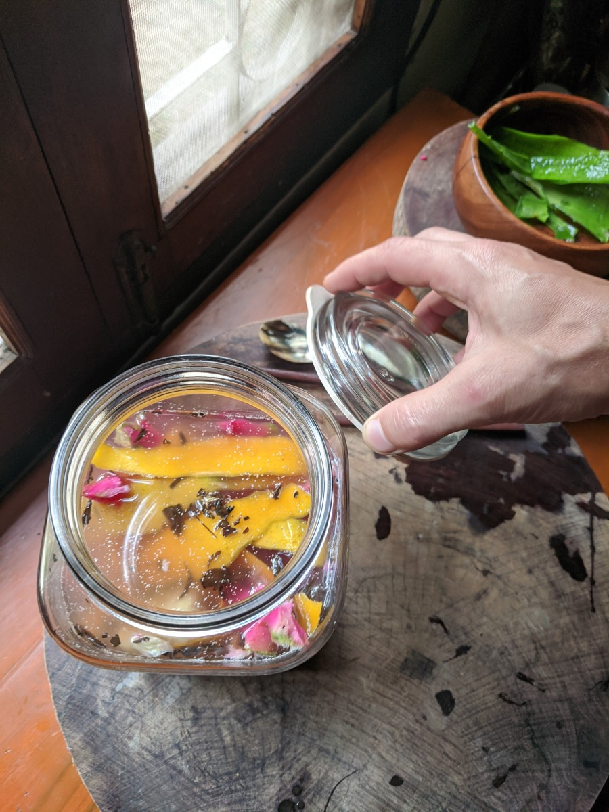
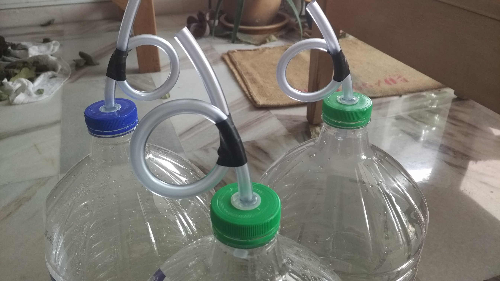
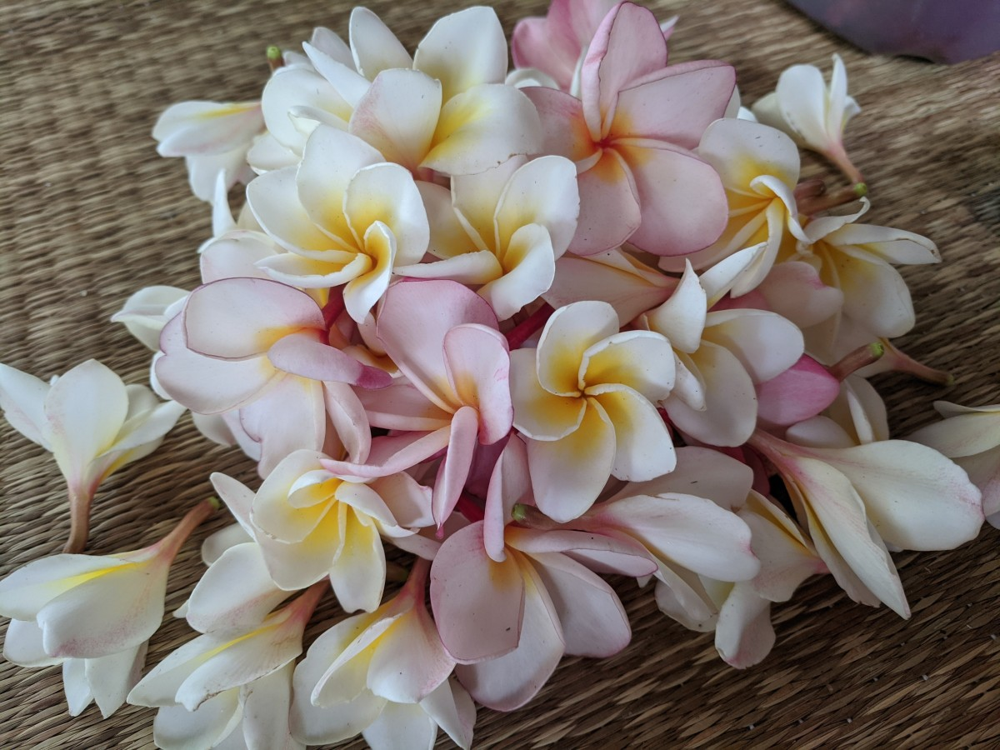
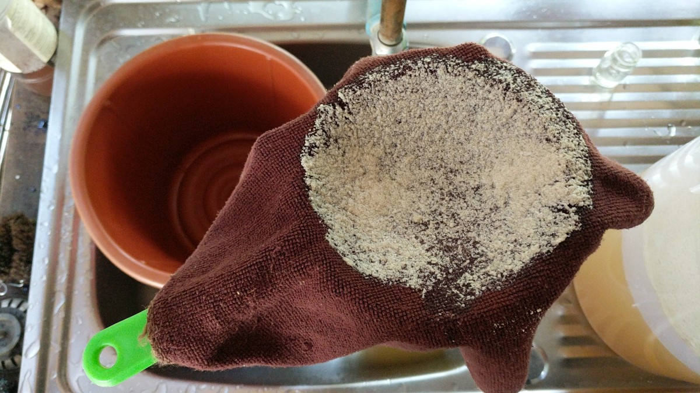
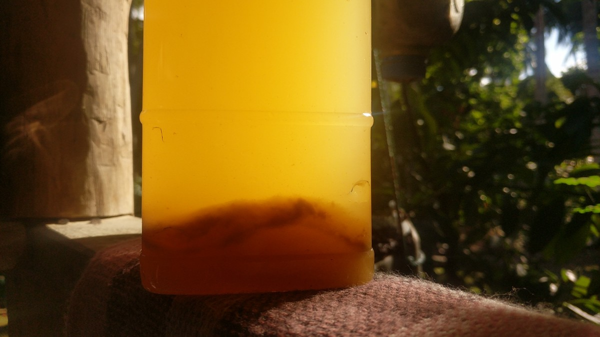
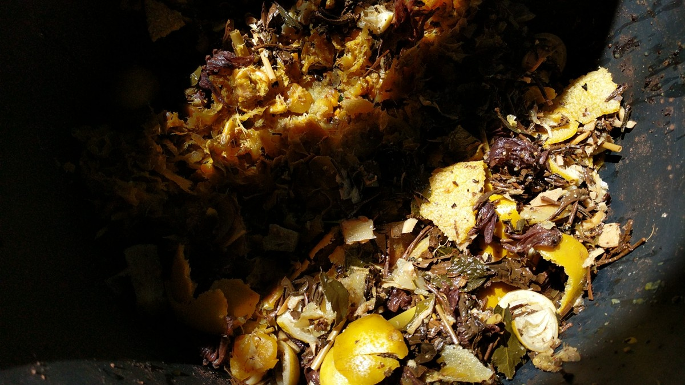
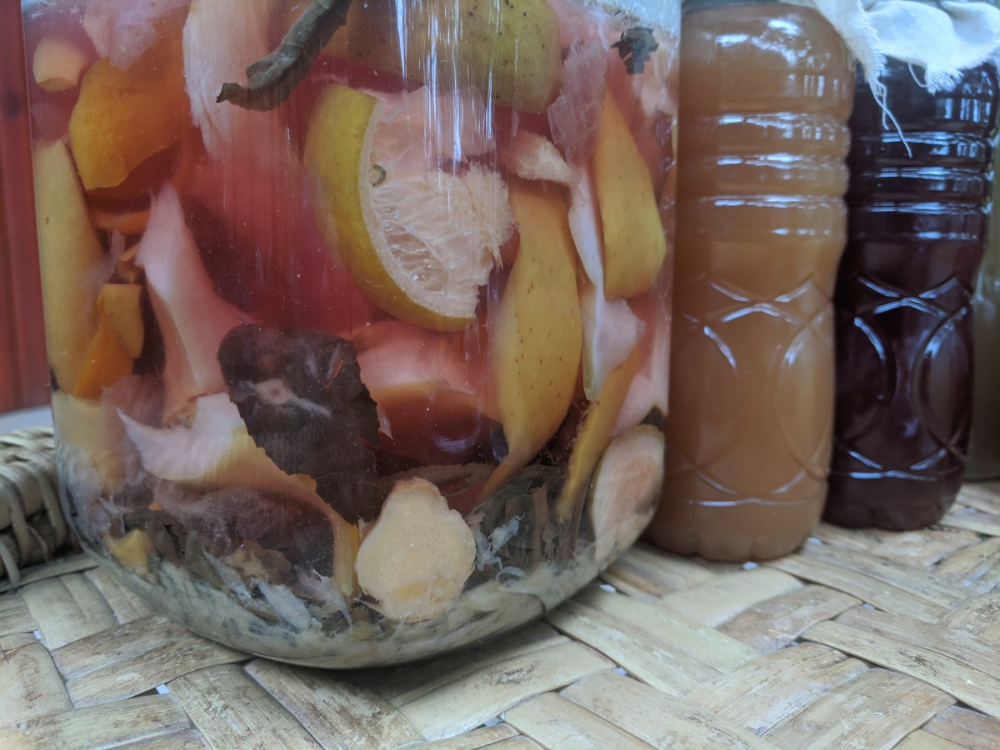
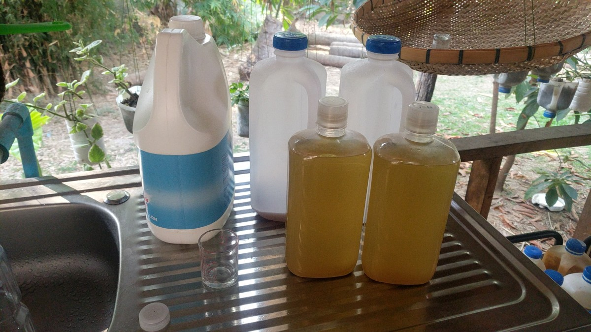
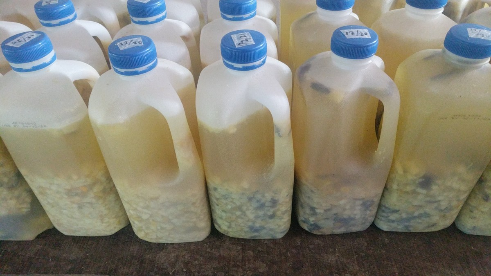

# Water Alchemy

*A personal record of fermentation practice — from cleaning to body care to drinking tonics.*

---

---

## Where This Began

This started as a cleaning product.

The process was simple: fruit peels, brown sugar, water, time. Three months of quiet fermentation in a dark corner. What came out was acidic, alive, and effective enough to clean a bathroom or cut through grease.

Then it became a body wash. The same ferment, different dilution — poured over skin in the shower, left to do what lactic acid and probiotic microbes do when given time against the surface of the body.

Then, gradually, it became something to drink.

That arc — from floor cleaner to skin care to morning tonic — is the practical story of this practice. The same living process, refined by use and curiosity, moved through every layer of the household and eventually inward.

---

## What the Ferment Is

A natural fermentation driven by lactic acid bacteria (LAB) and wild yeasts, fed by sugar, seeded by whatever lives on the surface of fruit and vegetable matter.

The microbiology is straightforward. Sugar feeds the microbes. The microbes digest the sugar and produce metabolites: organic acids (primarily lactic, some acetic), enzymes, antioxidants, amino acid derivatives. As fermentation progresses, pH drops — a well-fermented batch reaches around pH 4, which is where the antimicrobial properties become reliable and where the chemistry has done what it needs to do.

The result is acidic, complex, and alive with organisms that freeze-dried or powdered commercial preparations cannot match. Each batch is specific to its fruit, its water, its kitchen, its season.

*Like wine, sediment is normal and is a sign that the ferment is working.*

---

## Method

**The 1:4:10 Ratio** — a starting point, not a rule:

- 1 part sugar (brown sugar, jaggery, or molasses — something with mineral content works best)
- 4–5 parts fresh plant matter, chopped small
- 10 parts water

**Process:**

Fill the vessel roughly halfway with water. Dissolve the sugar. Add the plant matter. Cap loosely or use an airlock — in the first weeks, gas will build and needs to release. After the ferment stabilises and gas production slows, seal and leave it undisturbed.

**Three months minimum** from the date the last material was added. This is not a suggestion. The chemistry needs the full time.

The smaller the pieces, the faster the fermentation moves through the material. Keep the organic matter submerged so it stays in contact with the liquid rather than developing surface mold at the air boundary.

**Choosing plant matter:**

Citrus peels — orange, lemon, lime, pineapple — produce a powerful cleaning and skincare ferment: high organic acid content, strongly antimicrobial, fragrant. Medicinal aromatics like ginger, lemongrass, aloe vera, rose petals shift the character toward something gentler and more complex.

A dedicated vessel for citrus only. A separate vessel for everything else — vegetable scraps, spent herbs, whatever the kitchen produces.

**Harvest:**

Work in stages — each pass makes the next one faster. Begin with a colander to pull out the bulk of the solids. For a finer result, strain again through cloth. For a cleaner, more polished liquid, a final pass through paper (a coffee filter works well) settles out what cloth leaves behind.

Allow the filtered liquid to rest so any remaining sediment can settle to the bottom before bottling.

The solids go directly to the [bokashi soil system](soil-alchemy.md) or into the garden — they carry the same probiotic culture and are not waste.

---

## Uses: Cleaning and Body Care

The ferment works across a wide range of applications. What changes between them is concentration. These are the ratios used in this practice — not a formula, a record.

**Body and skin:**

| Use | Ratio |
|---|---|
| Body wash | 1:10 (enzyme:water) or combined with a small amount of liquid soap |
| Hair rinse | 1:50 to 1:100 |
| Mouthwash | 1:1 or undiluted |
| Wound cleaning | 1:10 |
| Warts and fungal infections | undiluted |
| Fruit and vegetable wash | 2 teaspoons per litre, soak 15–45 minutes |

The ferment acidifies the surface of the skin, which is the direction a healthy skin microbiome wants to move. Skin's natural pH sits slightly acidic; commercial soap is alkaline. This ferment works with that terrain rather than against it.

For oral use, the acidity that makes it an effective surface cleaner also makes it active against bacteria in the mouth. The same principle as acidic mouthwashes but alive rather than preserved.

**Cleaning:**

| Use | Ratio |
|---|---|
| Light surface cleaning | 1:10 |
| General household cleaning | 1:3 to 1:5 |
| Heavy degreasing | 1:1 or concentrate |
| Dishwashing | 1:1 with a little soap |
| Laundry | 1:500 |
| Drains and toilets | full strength, pour and leave |
| Air freshener (evaporative cooler) | 1:500 |

**Garden:**

| Use | Ratio |
|---|---|
| Fertiliser and soil drench | 1:1000 |
| Insect repellent | 1:500 to 1:1000 |
| Fruit and vegetable wash in the garden | 2 teaspoons per litre |

**A personal addition:** combining 30–50ml of liquid soap with 1 litre of ferment makes a concentrated degreaser/shampoo/cleaner that works well for many purposes from one bottle.

---

## The Drinking Tradition

The shift from topical use to internal use came through curiosity and through learning that this is an ancient tradition, not a new idea.

Drinking fermented vinegar tonics is one of the oldest patterns in human food culture. What changes across centuries and cultures is the name and the specific ingredients — the underlying process, sugar and acid and time, is constant.

---

### The Deep History

**Oxymel — Ancient Greece, ~400 BC**
The earliest documented drinking tonic of this kind. The name is Greek: *oxys* (acid) and *meli* (honey). Hippocrates prescribed it to patients around 400 BC. Honey and vinegar in water, used both medicinally and as an everyday drink. It spread through Rome and persisted in European folk medicine for over a thousand years, reappearing in Appalachian households well into the colonial period.

**Posca — Ancient Rome, ~100 BC**
Water and wine vinegar, the drink of soldiers, labourers, and the poor throughout the Roman military campaigns. Practical rather than elegant — the acidity helped purify questionable water from unfamiliar territories, and the drink kept well on long marches. Referenced by Pliny, Plutarch, and mentioned in the Gospels. Byzantine armies continued the tradition as *phouska*. A 360 AD decree specified that lower-ranking soldiers should alternate between posca and wine.

**Sekanjabin — Persia, 10th century**
The Persian vinegar syrup, documented in the 10th-century *Fihrist* of al-Nadim and described in the 12th-century medical encyclopedia *Zakhireye Kharazmshahi* by the physician Gorgani. Its name comes from *serke* (vinegar) and *angobin* (honey). Avicenna prescribed it for fevers, digestive complaints, and asthma. Made with sugar or honey, vinegar, and fresh mint — still made in Iran today, diluted with water and served with crisp lettuce leaves in summer.

**Sharab → Shrub — The Linguistic Journey**
The Arabic root *sh-r-b* means *to drink*. From it came *shariba* (he drank) and *sharāb* (a beverage) — and from there, over centuries of trade and language crossing, the English words *sherbet*, *sorbet*, *syrup*, and *shrub*. The sherbet tradition in Muslim cultures, where alcohol was forbidden, produced a rich vocabulary of fruit and flower syrups diluted with water (and sometimes vinegar for preservation). Trading ships carried these into Western Europe by the mid-17th century.

**Shrubs in Colonial America — early 1700s**
Shrubs arrived in America from England, where vinegar had long been used to preserve berries and fruit through the off-season — the preserved fruit was itself called a shrub. In 18th-century America they became widely fashionable: Martha Washington and Thomas Jefferson both made and served them. At their height they functioned as what we would now call an energy drink — sugar for calories, water for hydration, vinegar to stimulate digestion and quench thirst in a way plain water did not.

By the mid-1800s shrub recipes appeared in household cookbooks like Lydia Maria Child's frugality guide. By the 19th century, the typical method was vinegar poured over fruit (usually berries), infused overnight or for several days, then strained and mixed with sugar into a syrup. Diluted with water to drink. In 2006 shrubs were inducted into the international Slow Food Ark of Taste — the organisation's recognition of traditional food preparations at risk of being lost.

**Switchel — Haymaker's Punch, 1800s**
Origins traced to the Caribbean and New England, first documented in writing from 1856. The drink of agricultural workers during the hot harvest season — also called Yankee punch, ginger water, swizzle, and most commonly haymaker's punch. The classic recipe from an 1800s almanac: *five gallons of good water, half a gallon of molasses, one quart of vinegar, and two ounces of powdered ginger.* Served cold in the field, described at the time as "not only a very pleasant beverage, but one highly invigorating and healthful." It appears in the *Little House on the Prairie* books, which marks how widespread it was in 19th-century American life.

**Four Thieves Vinegar — plague-era Europe**
An herbal vinegar tonic that circulated during the Black Death outbreaks in Europe from the 14th century onward. A recipe from a Paris museum, dated 1937 but much older, called for three pints of strong white wine vinegar with wormwood, meadowsweet, wild marjoram, sage, cloves, angelica root, rosemary, horehound, and camphor, steeped for fifteen days. The likely mechanism was insect repellence — wormwood, sage, cloves, rosemary and camphor are all natural flea deterrents, and the flea was the carrier of the plague bacillus. Modern fire cider is a direct descendant of this tradition.

**Fire Cider — 1970s, Rosemary Gladstar**
The American herbalist Rosemary Gladstar coined the term in the early 1980s at the California School of Herbal Studies, giving a name to a practice with roots going back centuries. Horseradish, ginger, garlic, cayenne, turmeric and other pungent roots and herbs, steeped in apple cider vinegar. The name reflects the character of the ingredients — sharp, warming, activating.

---

### This Practice: Making from Scratch

The fire cider tradition uses apple cider vinegar as a ready-made base. This practice starts earlier in the process.

The vinegar itself is made from scratch: sugar, water, and fruit matter, fermented for three months or longer until the acetic acid bacteria have had their full run and the liquid has turned. The result is a living vinegar — the full culture still present — rather than a commercial approximation pasteurised and filtered for shelf stability.

Different fruit and plant combinations produce entirely different flavours. Citrus forward. Ginger dominant. Rose and hibiscus. Pineapple and lemongrass. The fermentation rounds hard edges and builds complexity that no formula predicts — each batch develops its own character, influenced by what went in, when, and the ambient culture of the space it fermented in.

*Shrub* is the historical name for what this practice produces when intended as a drinking tonic.

To drink: diluted with still or sparkling water. Started small. The acidity is real and the microbial load is live. The body responds distinctly, and that response is information worth attending to.

The batches intended for drinking are treated differently from the cleaning batches: fruit matter chosen for flavour and internal benefit rather than cleaning power, longer fermentation (three months minimum, often longer), and cleaner inputs — whole fresh peels rather than general kitchen scraps accumulated over weeks.

---

## Practical Notes

**On sugar:** Molasses, jaggery, or brown sugar are preferable to white. They carry minerals that make a richer product. When fermenting large quantities of fruit with high natural sugar content, the added sugar can be reduced.

**On airlocks:** An airlock rather than a loose cap keeps insects out and allows gas to escape without exposing the ferment to open air. Plastic containers handle pressure well and are easy to clean.

**On temperature:** Away from direct sunlight, in a place where temperature stays reasonably consistent. Warmth speeds the process; cold slows it.

**On the surface layer:** A white film — kahm yeast — forming on the surface is normal and harmless. It can be skimmed off or strained out at harvest. A sign the ferment is alive, not that something has gone wrong.

**On colour:** A healthy ferment turns yellow to amber-brown and smells sour and fermented. If the ferment turns black, add the same amount of brown sugar again and continue fermenting for another month.

**On consecutive batches:** A portion of the liquid from one batch can be added to the next as a starter, which shortens the time to full fermentation.

**On cutting small:** The smaller the material, the faster fermentation moves through it and the more complex the final product.

---

## A Note on This Practice

What this shares with distillation, with bokashi, with any fermentation work is time. Nothing here is instant, and the three-month minimum is not arbitrary — it is the minimum required for the chemistry to do what it does.

The fruit that would have been discarded. The water in the vessel. The corner where the temperature stays consistent. These are the inputs. Time and the organisms already present in the kitchen and on the fruit do the rest.

*This is a personal record of ongoing practice. Nothing here is instruction.*

---

*Continue reading: [Soil Alchemy — Bokashi →](soil-alchemy.md)*

*[← Back to Index](README.md)*
