# The Measure of Your Fire
## The Cabala mineralis, a wordless second book, and the practise of Mary the Prophetess

---

> *"Mary said that the Vessel of Hermes which the Stoicks have concealed, and it is not a Necromanticall Vessel, but it is the Measure of your Fire."*

Seventeen centuries of seekers hunted for the Hermetic Vessel as an object — a flask of special glass, a shape, a thing that could be bought or built or stolen. Mary's answer, when it finally surfaces in the record, dissolves the whole search. There is no vessel to find. The vessel is the fire-regimen itself: the discipline of temperature, held steadily, over time. The container is how you keep the heat.

Anyone who has sat with a sealed jar through a long fermentation, or held a distillation at the exact edge where the volatile rises without scorching, recognises this sentence from inside. The apparatus was never the secret. The tending was.

This entry is the record of how that line arrived in the archive — through a small seventeenth-century picture-book called the *Cabala mineralis*, two copies of it, and the text that travels with its wordless second half.

---

## A book of pictures signed with a rabbi's name

The *Cabala mineralis* is a short illustrated manuscript signed *Rabbi Simeon Ben Cantara* — a figure otherwise unknown, almost certainly a pseudonym in the long tradition of alchemical attributions. Two copies came into the archive this month. The [Warburg Institute's copy](https://wdl.warburg.sas.ac.uk/object-wdl-wco-aaez) (classmark FGH 6480, from the Innes Collection) is freely digitized: thirty-two small pages, all in colour, a clean Latin hand. The better-known copy is British Library Add MS 5245, whose plates circulate with English translations in a [widely shared digital booklet](https://archive.org/details/cabala-mineralis-manuscript-book-1) and on [Adam McLean's alchemy website](https://www.alchemywebsite.com/cab_min1.html).

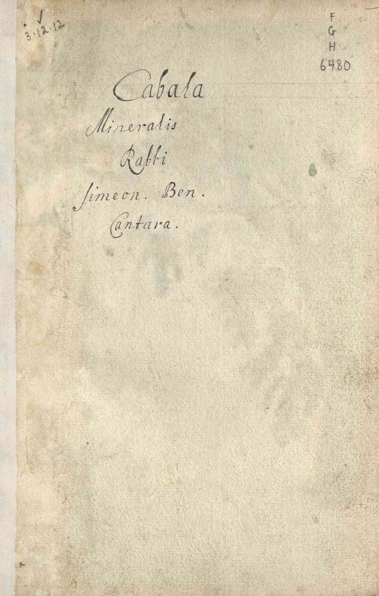

The whole first book is seven painted plates with short Latin captions. That brevity is the point. Where other alchemical texts bury the work under hundreds of pages of allegory, this one shows it — vessel by vessel, colour by colour — and says almost nothing. What it does say, it says three times in its opening breath:

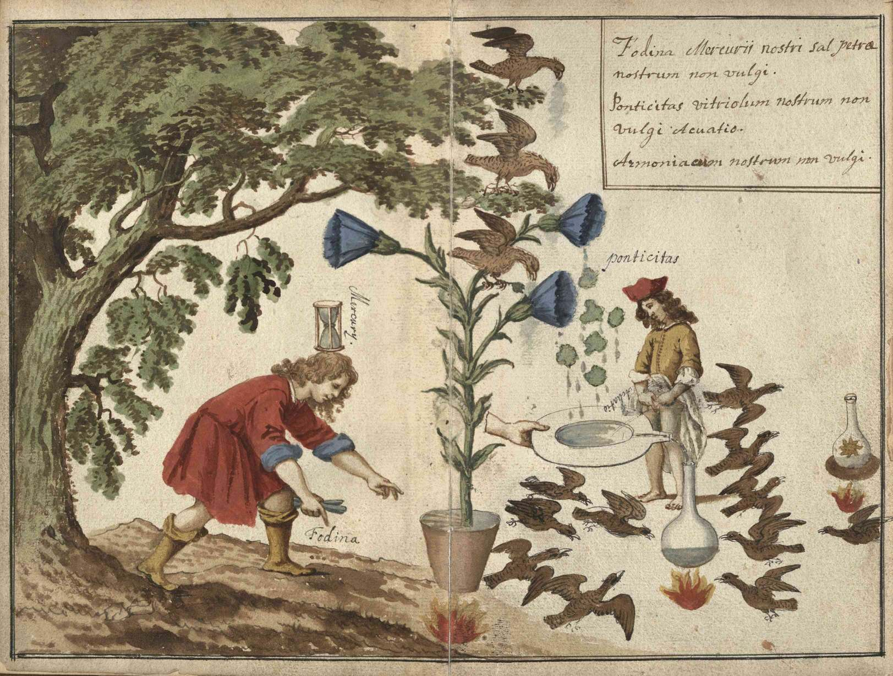

> *Fodina Mercurii nostri sal petra nostrum non vulgi.*
> *Ponticitas vitriolum nostrum non vulgi Acuatio.*
> *Armoniacum nostrum non vulgi.*
>
> The mine of our Mercury; our saltpetre, **not the common sort**. Ponticity — our vitriol, **not the common** — the sharpening. Our sal ammoniac, **not the common**.

Three named substances, and three denials. Whatever this work runs on, the author insists, it is not the apothecary's saltpetre, vitriol, or sal ammoniac. Those are cover-names. The real matter comes from the *fodina* — the mine — and the mine is drawn as a boy reaching toward his own ground, the hourglass of Mercury balanced on his head. Time, and the body, and the ground underfoot.

The second plate shows where the mine is.

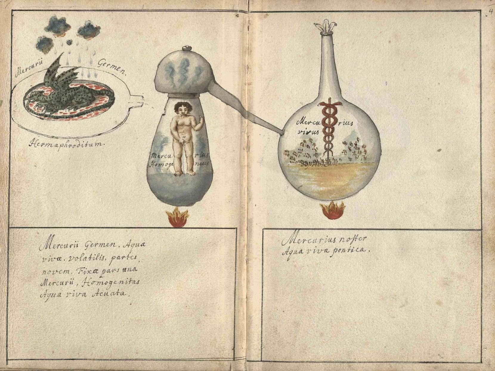

> *Mercurii Germen: Aquae vivae volatilis partes novem, Fixae pars una Mercurii. Homogenitas: Aqua viva Acuata.*
>
> The Seed of Mercury: nine parts of the volatile living water, one part of the fixed. Homogeneity: the living water sharpened.

Inside the distillation vessel stands a child, urinating. The caption calls what he gives *aqua viva* — the living water. The captions never say the plain word; the picture says it for them. This is the same figure the whole tradition keeps circling — the despised, abundant, golden matter that [every cover-name in the record describes and no cover-name names](women-of-alchemy.md). Here it is not even coded. It is painted.

The reading is iconographic, and it is stated as such: the words on the page say only *living water*. But a child pissing into the philosopher's flask, labelled "homogeneous Mercury," under a caption prescribing nine parts volatile to one part fixed, leaves little room for the mineral interpretation. The *fodina* of our Mercury is the body.

---

## Seven plates, one month

The remaining plates run the whole work in sequence, each vessel over its small steady fire, the eagle-flocks around them counting sublimations — five for the lunar work, seven for the solar.

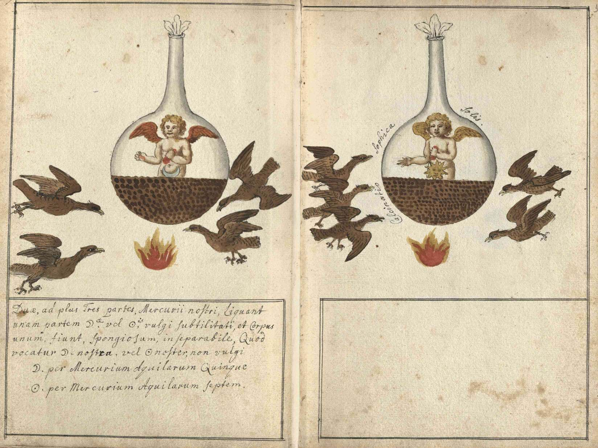

> *Duae, ad plus tres partes Mercurii nostri ligant unam partem Lunae vel Solis vulgi subtilitati... Quod vocatur Luna nostra, vel Sol noster, non vulgi.*
>
> Two, at most three parts of our Mercury bind one part of common Silver or Gold... which is called our Silver or our Gold, not the common.

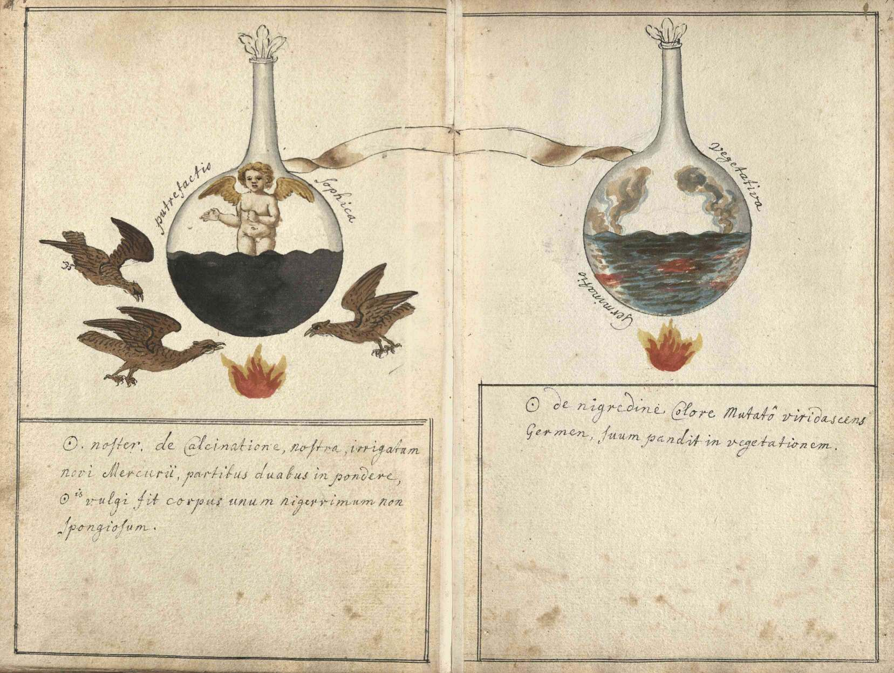

> *Sol de nigredine colore mutato viridascens Germen suum pandit in vegetationem.*
>
> The Gold, its colour changed from blackness, growing green, unfolds its seed into vegetation.

The blackening, and then the green. The dead matter puts out a shoot. Anyone who has watched a long ferment turn — the darkness that looks final, and then is not — knows this corner.

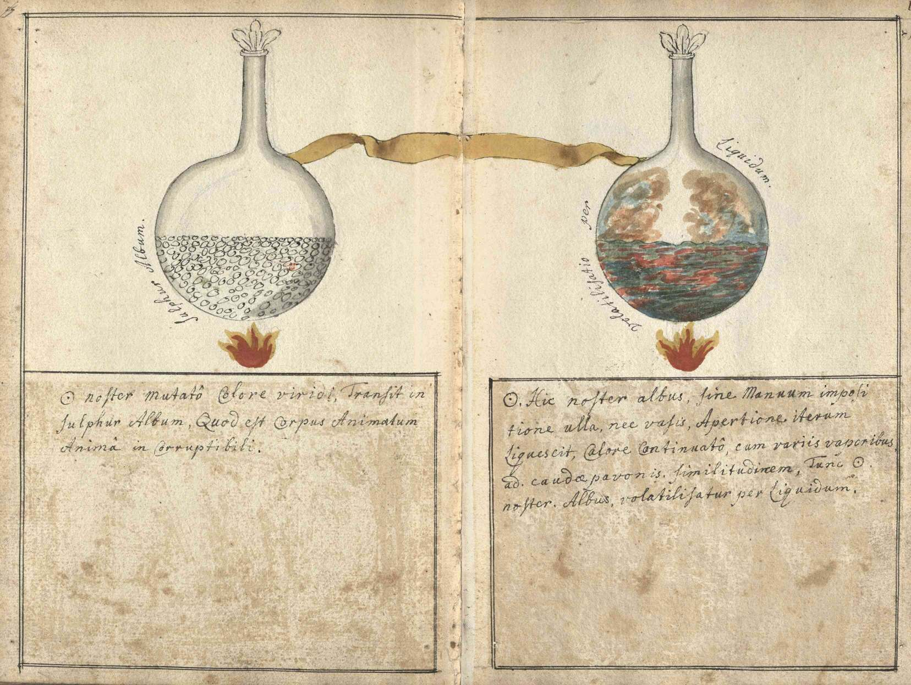

> *Hic Sol noster albus, sine manuum impositione ulla, nec vasis apertione, iterum liquescit, calore continuato, cum variis vaporibus ad caudae pavonis similitudinem.*
>
> This our white Gold — without any laying-on of hands, and without opening the vessel — liquefies again under continued heat, with various vapours in the likeness of the peacock's tail.

*Sine manuum impositione* — without hands. From this point the operator's only instrument is the fire itself. The vessel stays sealed. Nothing is added, nothing adjusted, nothing rescued. The work proceeds because the temperature is held. Mary's sentence about the vessel is already here, forty pages before she says it.

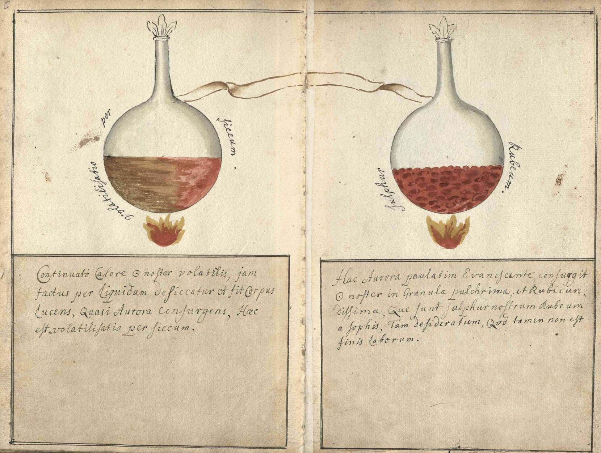

> *Consurgit Sol noster in granula pulcherrima et rubicundissima... quod tamen non est finis laborum.*
>
> Our Gold rises up into little grains, most beautiful and deepest red... which nevertheless is not the end of the labours.

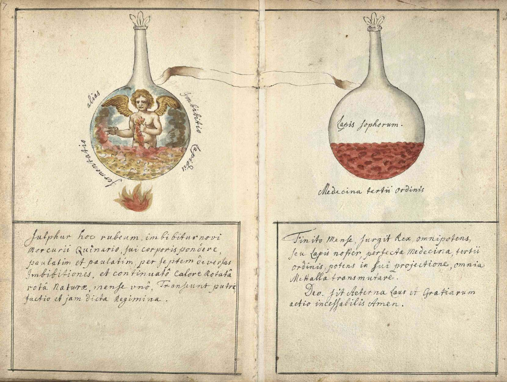

> *Finito mense, surgit Rex omnipotens, seu Lapis noster, perfecta Medecina tertii ordinis... Deo sit aeterna laus et gratiarum actio incessabilis. Amen.*
>
> The month being finished, there arises the almighty King, or our Stone, the perfect Medicine of the third order... To God be eternal praise and unceasing thanksgiving. Amen.

One month. Seven imbibitions, each one a return of fresh living water to the red matter, *paulatim et paulatim* — little by little, little by little. The wheel of Nature turned by nothing but patience and heat. And the last flask in the book is the only one drawn without fire under it. The work that needed tending no longer needs it.

---

## The second book has no words

Then the manuscript does something stranger than anything in its first half.

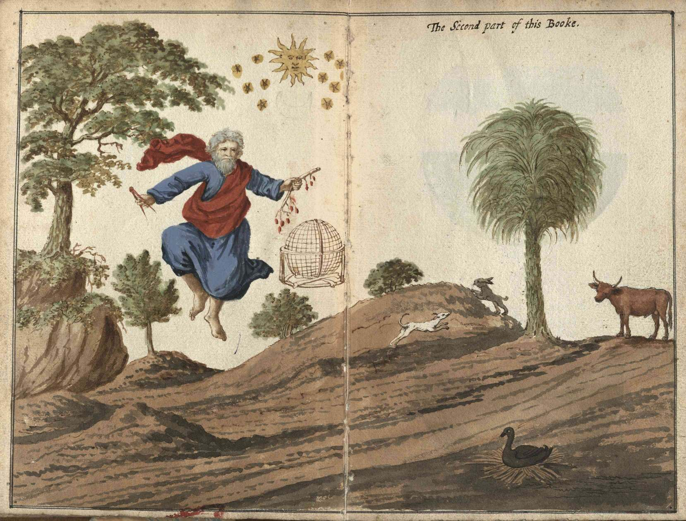

"The Second part of this Booke," says the one English line in the Warburg copy — and then the captions stop. Both copies go silent at the same threshold. The Warburg copy carries two more pages of figures with ruled caption-boxes left empty, and a speech-scroll at a man's mouth left blank. The British Library copy has five plates here, equally wordless — including two pairs of roundels the Warburg copy lacks entirely:

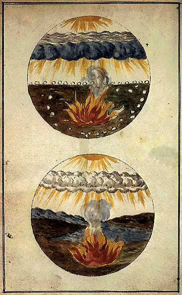

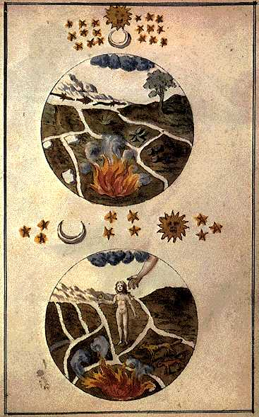

A child in the blackened, broken field, held by a hand from a cloud. A body on a mat with drops falling from its skin, a scroll at its mouth with nothing written on it:

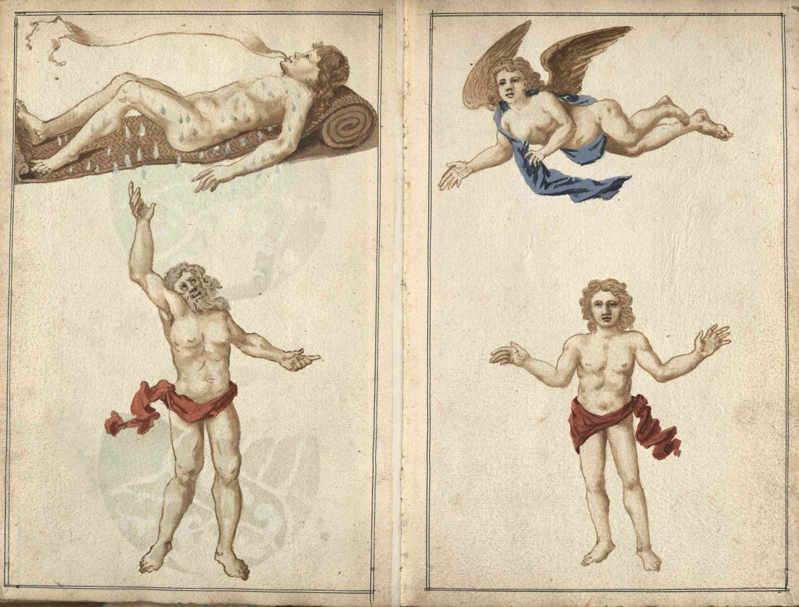

Whether the copyist stopped, or the silence is deliberate, the record does not say. The empty scroll sits on the page either way: the second half of the work, the part past the month of fire, is shown and not spoken. What fills the silence in the circulating editions is a text — and the text is hers.

---

## The practise of Mary the Prophetess

The editions that carry the *Cabala mineralis* pair its wordless second book with a dialogue: **"The practise of Mary the Prophetess in the Alchymicall Art"** — Mary the Jewess of Alexandria, [the first true alchemist of the Western record](women-of-alchemy.md), answering the questions of a philosopher named Aros. The pairing is editorial tradition; the English text survives separately, in British Library MS Sloane 3641, and was printed across Europe from 1572 onward. However the two came to travel together, they fit. The picture-book shows a work driven by nothing but held heat. The dialogue is the oldest voice in the tradition explaining that this is the entire secret.

Aros comes to her with the question every beginner asks — how long?

> *"O Prophetess, I have truly heard many say of you that you whiten the Stone in one day."*
>
> *And Mary said, Yea, Aros, even in a part of one day... Hermes in all his Books has said that the Philosophers whiten the Stone in one hour of the day."*

And then the instruction, which is not a list of substances but a way of sitting with fire:

> *"Keep the fume and take care that none of it fly away. And let your measure be with a gentle fire such as is the Measure of the heat of the Sun in the Month of June or July, and stay by your Vessel and behold it with care how it grows black, grows red, and grows white in less than three hours of the day."*

The fire of the sun in June or July. Body-warm, summer-warm — the temperature of a fermentation jar on a Mediterranean windowsill, the temperature of the bain-marie that still carries her name, the temperature of gestation. *Stay by your vessel and behold it with care.* The verbs are a caretaker's verbs. And when Aros finally asks about the apparatus itself, she closes the door the whole later tradition would spend centuries knocking on:

> *"...the Vessel of Hermes which the Stoicks have concealed, and it is not a Necromanticall Vessel, but it is the Measure of your Fire."*

There is no magic flask. There is no purchase to make. The vessel is the regimen of heat — which means the vessel is the practitioner's own steadiness, and nothing in the work can be delegated to equipment. The kerotakis, the tribikos, the double boiler: [her inventions were all instruments for holding temperature](women-of-alchemy.md), because temperature was the thing being taught.

She says one more thing worth carrying. Asked why the philosophers describe the work as taking a year, she answers that they *"have allways made the regimen longer... and this but onely for hiding it from the ignorant"* — the length was the disguise. The work itself moves at the speed of a body: hours, days, one month for the wheel to turn. The *Cabala mineralis* says the same in paint. A month of held fire, and the last vessel needs no flame.

---

The manuscript's first book ends with a doxology and the second book ends with a blank scroll. Between them sits everything this archive keeps finding from the inside: the living water gathered from the body's own mine, the sealed vessel, the blackening that becomes green, the month of patience, and a woman's voice at the root of the tradition saying that the container was never a thing at all.

The vessel is the measure of the fire. The fire is held by the one who stays.

---

*One practitioner's record, written from inside the work. Not medical guidance. → [How to read this archive](how-to-read-this.md)*

---

### Sources

*Gathered here so the piece reads unbroken. Where a reading is interpretation, that is said plainly.*

- **The Warburg copy:** [Cabala mineralis, Warburg Institute Digital Library](https://wdl.warburg.sas.ac.uk/object-wdl-wco-aaez) (FGH 6480, Innes Collection) — the source of all Warburg plate images above, and of the Latin transcriptions, which were made fresh from the scans for this archive's bibliography companion (full transcription with translation lives beside the PDF in the bibliography, `alchemy/BenCantara-Cabala-Mineralis.md`).
- **The British Library copy:** Add MS 5245. Its plates and English translations circulate via [archive.org](https://archive.org/details/cabala-mineralis-manuscript-book-1) and [Adam McLean's alchemy website — first book](https://www.alchemywebsite.com/cab_min1.html), [second book](https://www.alchemywebsite.com/cab_min2.html); the roundel images above are from McLean's pages.
- **The Mary the Prophetess dialogue:** transcribed from BL MS Sloane 3641 fols. 1–8, as given on [McLean's site](https://alchemywebsite.com/maryprof.html); printed in *Auriferae artis* (1572), *Alchymia vera* (1604), *Opus Aureum* (1604), *Lumen chymicum novum* (1624), and *Theatrum chemicum* vol. 6 (1659). **Honesty note:** Sloane 3641 is a different manuscript from Add MS 5245; the pairing of dialogue and plates is the editorial tradition of the circulating editions, and whether Add MS 5245 itself contains the dialogue has not been verified here.
- **The urine reading of Plate 2:** the captions say only *aqua viva*; the identification rests on the imagery (the urinating child labelled *Mercurius Homogeneus*) and is the common modern reading (McLean among others). Held as iconographic interpretation, stated as such.
- **Mary the Jewess:** Raphael Patai, *The Jewish Alchemists* (Princeton, 1994), on the *Dialogue of Mary and Aros* as the central Latin-tradition testimony; see also [Women of Alchemy](women-of-alchemy.md) in this archive.

---

*Continue reading: [Women of Alchemy →](women-of-alchemy.md)*

*[← Back to Index](../README.md)*
