### Living Waters

Before the slides, there is the field that made them possible.

Megan and Fiona were the first women I shared this experience with because I knew they would hear me. Megan held the room. Fiona's work influenced the visual language of the images. The exchange between us is part of the presentation itself: the way women recognize, refine, and return a thing to one another until it can be spoken.

### 1 - 2

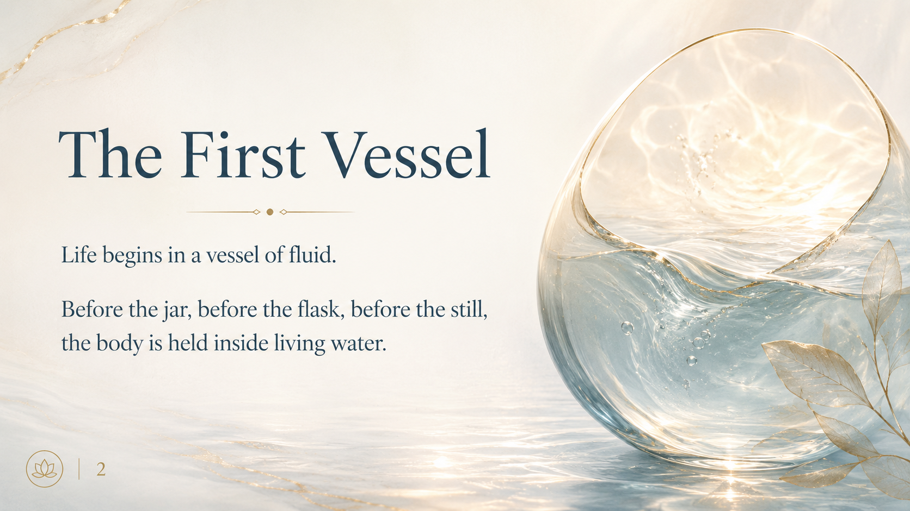

This is where I want to begin: not with the distiller, not with the measurements, and not with the unusualness of the practice.

I want to begin with something every human body knows before language.

Life begins held in fluid.

Before we ever touch water outside the body, we are formed inside water. The first environment is not air. It is a living vessel, a fluid field, a membrane, a rhythm, a maternal interior.

So when I speak about vessels, distillation, fluids, and return, I am not beginning with a machine. I am beginning with the body’s original condition.

The jar, the flask, and the still come much later.

The first vessel is the living body.

### 3

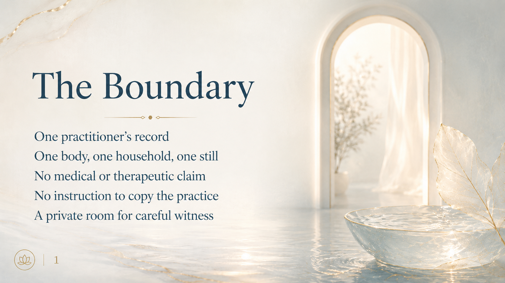

This is the central thesis of the whole presentation.

The body is not passive material. The body is already a living laboratory, a vessel, a field of intelligence.

Before there is a still on the counter, the body is already separating. It separates what can be used from what must be released. It concentrates certain substances. It transforms food, water, breath, heat, emotion, stress, rest, cycle, and environment into lived chemistry.

It returns material through circulation, elimination, sweat, breath, blood, milk, tears, and urine. And it records. It records in scent, texture, clarity, density, color, rhythm, ease, aversion, appetite, dreams, and mood.

So when I bring distillation into the practice, I am not saying the machine creates the mystery.

The still does not invent the process.

It gives the process a visible edge.

It lets me see, smell, separate, and compare voices that were already present inside one material.

(This is also where the audience begins to understand why the work belongs to witnessing rather than copying.)

### 4

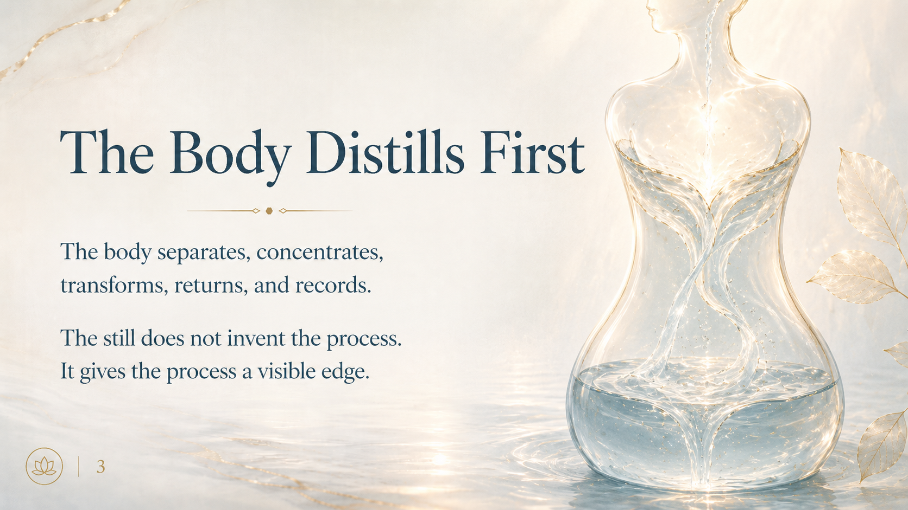

This slide opens the idea of the fluid as a record.

A fluid does not arrive from nowhere. It carries the conditions upstream.

What was eaten. What was drunk. How the body slept. Whether there was ease or stress. Whether there was movement, intimacy, meditation, fatigue, travel, heat, cold, social contact, solitude, or emotional intensity.

It also carries timing.

A morning sample is not the same as a midday sample. A cycle-phase sample is not the same as another cycle-phase sample. A full moon day, a travel day, a rest day, a day after fruit, a day after coffee, a day of deep sleep — all of these belong to the record.

So when I say “a fluid is a record,” I do not mean it is a fixed identity.

I mean it is a moving imprint.

It is a record of relationship between body, practice, environment, and time.

**Purpose of the slide**

This slide prepares the audience for the measurement section later. It tells them not to read the numbers as isolated “good” or “bad” readings. Each fluid reading belongs to a living context.

The real archive is not only the meter. It is the relationship between:

fluid + body state + timing + environment + practice.

### 5

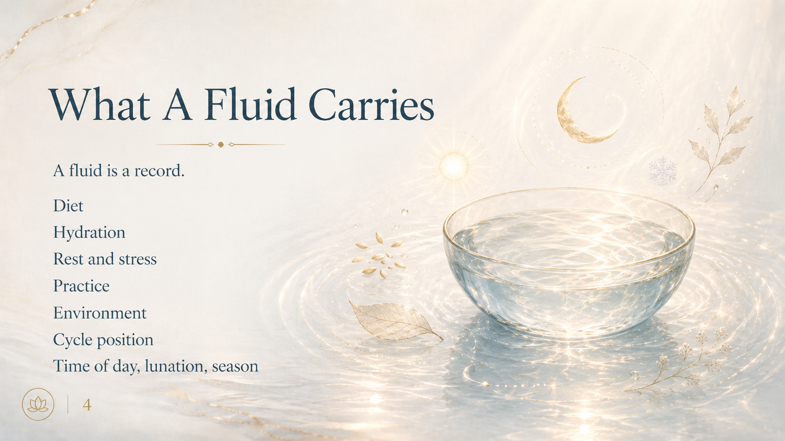

This slide shows the pattern underneath the whole presentation.

I am not trying to isolate the body from nature. I am trying to show that the body participates in the same movements we see everywhere.

Separation happens in digestion, filtration, and elimination. It also happens when rain moves through soil, when sediment settles, when water clarifies itself through contact with earth.

Concentration happens in urine, bile, sweat, blood, and milk. It also happens in sap, brine, resin, salt flats, fruit, and minerals.

Transformation happens through metabolism, fermentation, compost, heat, decay, ripening, and time.

Return happens through circulation, feedback, watershed, breath, evaporation, atmosphere, and rain.

And record appears everywhere. The body records through chemistry, scent, texture, color, rhythm, and feeling. The world records through tree rings, strata, bloom, sediment, mineral stain, and seasonal return.

So the body is not separate from the world’s intelligence.

The body is one place where the world’s intelligence becomes intimate.

**Purpose of the slide**

This is the bridge slide. It connects physiology, ecology, and alchemy without forcing the audience into the measurement data too quickly.

It says: this is not only about one substance. It is about a recurring pattern of life.

### 6

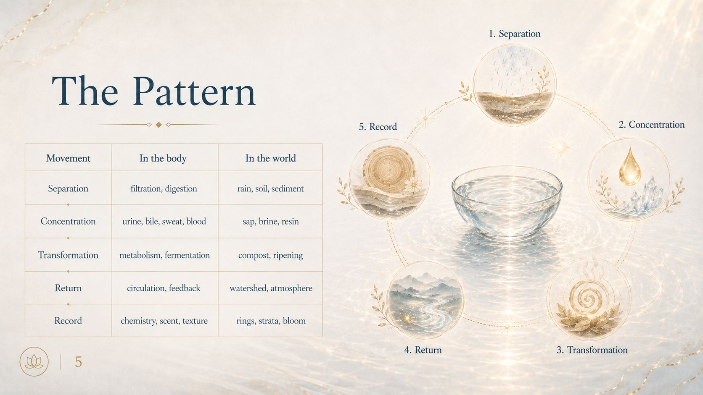

This slide brings the pattern into the female body.

Women do not need to be taught that the body moves in cycles. The body teaches this directly.

The womb is one of the clearest places where cyclical intelligence becomes visible. It prepares. It thickens. It receives. It ripens. It releases. And then it begins again.

This is not a metaphor imposed from the outside. It is an embodied rhythm.

The menstrual cycle shows that the body is not linear. It does not simply produce, consume, and discard. It builds relationship with time. It prepares for possibility. It responds to signals. It changes texture, temperature, fluid, mood, appetite, receptivity, and perception.

For women, fluid is not abstract.

Blood, cervical fluid, amniotic fluid, milk, tears, sweat, urine — these are not just biological outputs. They are thresholds of information. They tell us something about timing, state, season, nourishment, stress, fertility, grief, intimacy, and return.

So when I say that a fluid is a record, women already know this somewhere in the body.

The womb is not the only vessel, but it is one of the clearest teachers.

**Purpose of the slide**

This slide makes the presentation explicitly feminine without becoming exclusionary or overly symbolic. It grounds the work in cycle literacy: women already have lived access to fluid, timing, change, and return.

It also prepares the audience for Slide 7, where the menstrual cycle is mapped through physiological and alchemical language.
 

### 7

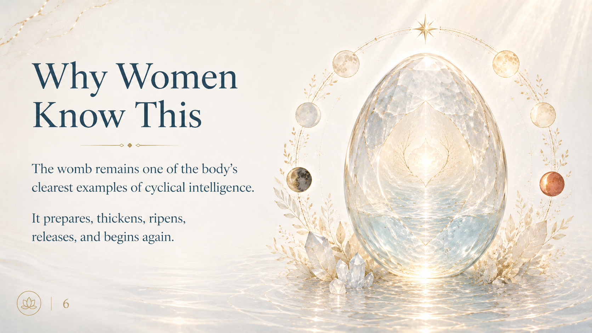

This slide brings the cycle into a translation map.

The menstrual cycle can be described physiologically, but it can also be felt as an alchemical rhythm.

Menstruation is release. It is shedding, descent, emptying, darkening, and return to the ground. In alchemical language, this belongs near nigredo — the blackening, the breakdown, the necessary undoing.

The follicular rise is rebuilding. The body clarifies, restores, and begins again. There is a sense of light returning, of freshness, of preparation. This belongs near albedo — whitening, washing, clarification.

Ovulation is emergence. It is brightness, visibility, expression, attraction, and fullness. In alchemical language, this belongs near citrinitas — the yellowing, the golden dawn, the moment of radiance.

The luteal phase brings heat, deepening, density, discernment, and return. Something gathers. Something ripens. Something either prepares for holding or prepares to release. This belongs near rubedo — the reddening, embodiment, completion, and return to blood.

This is not meant as a rigid system.

It is a way of seeing that the female body already moves through phases of release, clarification, radiance, heat, and return.

**Purpose of the slide**

This slide makes the alchemical language understandable. It prevents the terms from feeling decorative or abstract by pairing each one with a real cycle movement.

It also prepares the audience for the menstrual measurement slide later, where the “cycle question” becomes part of the record.

### 8

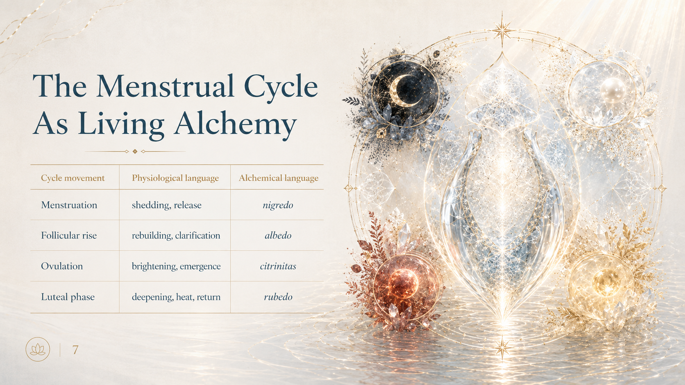

This slide places the work in companionship with women before us.

Not as proof. Not as authority. Not as a lineage claim that needs to be defended.

More simply: women have always known vessels.

Women have worked with liquids, heat, extraction, concentration, scent, herbs, blood, birth, milk, fire, kitchens, baths, and closed loops for a very long time.

Tapputi-Belatekallim is one of the earliest named women associated with perfumery and repeated material processes — extraction, filtration, and distillation-like preparations.

Mary the Jewess is remembered through alchemical tradition for her relationship with vessels, baths, containment, and receiving arms. The bain-marie itself carries her name through history.

Cleopatra the Alchemist gives us the ouroboros: the closed loop, the serpent eating its own tail, the return of material to itself.

And then there are the unnamed women.

The women in kitchens. The women at births. The women with herbs. The women tending blood, steam, water, pots, cloth, vessels, smoke, milk, wounds, and fire.

This history matters because it makes the work less lonely.

It gives companionship to observation.

It reminds us that careful witnessing has always lived close to women’s hands.

**Purpose of the slide**

This slide gives the presentation ancestry without needing to overclaim. It says: this work is unusual in its current form, but the gestures are old — vessel, heat, fluid, return, observation, care.

It also prepares the audience for the translation map in Slide 9.

### 9

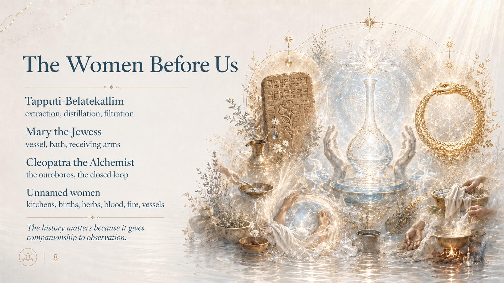

This slide is a translation map.

It is not saying that alchemy, physiology, and lived experience are the same language. They are not. Each language has its own limits and its own intelligence.

But they can be placed beside one another.

The vessel in alchemy may be the flask, the retort, the closed container. In the body, the vessel may be the womb, an organ, a membrane, or the boundary of the body itself. In lived experience, the vessel is the held field — the condition that allows observation to occur.

Fire in alchemy is heat. In the body, it is metabolism, digestion, transformation, inflammation, desire, effort, and intensity.

The volatile is what rises quickly. It is sharp, expressive, fast-moving, and often the first thing to announce itself.

The carrier is what holds and carries more quietly. This is the lunar middle, the clear receiving fraction, the part that may not speak loudly but can hold the pattern.

The fixed is what remains. It is the salt, the mineral load, the retentate, the density, the residue, the weight.

And return is the closed loop — ouroboros, feedback, recognition. The material returns to itself, and the observer also returns to the material with new eyes.

This is not a rigid equivalence.

It is a way of keeping several kinds of knowing in relationship without collapsing them into one another.

**Purpose of the slide**

This slide protects the language from becoming vague. It shows that you are using alchemical terms as translation tools, not as decorative claims.

It also helps the audience understand the upcoming “Three Waters” slide, where spirit, essence, and serum become working names for observed fractions.

### 10

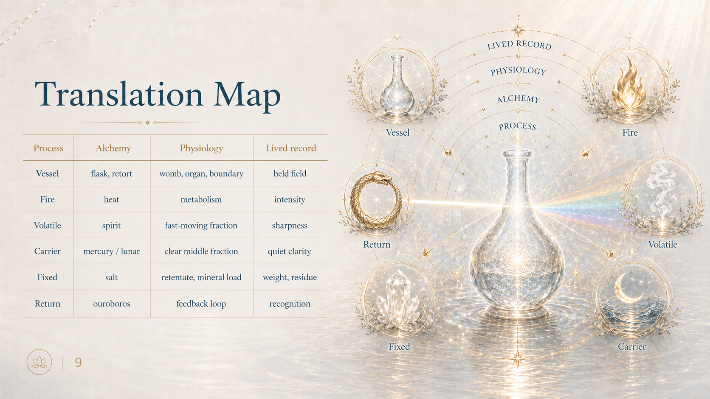

This slide introduces the working names I am using for the fractions.

These are not final scientific categories. They are observational names. They help me keep track of what the material seems to express once the still separates it.

The early fraction comes forward quickly. It is sharper, more volatile, more expressive. I am calling this the Solar spirit because it announces itself. It rises first. It has brightness, movement, and intensity.

The middle fraction is quieter. It is clearer, softer, more carrying. It does not have the same sharp announcement. I am calling this the Lunar essence because it feels more receptive, more transparent, more like a carrier field.

The fixed remainder is what does not rise in the same way. It stays behind. It gathers density, mineral load, weight, residue. I am calling this the Saturn serum because it marks the retained pole of the process.

What matters here is not the name alone.

What matters is that one starting material does not behave as one voice.

The still separates voices that were hidden inside one material.

**Purpose of the slide**

This slide translates the prior map into your actual working practice. It gives the audience a vocabulary for the next measurement slides:

spirit = early volatile fraction
essence = middle clear carrying fraction
serum = fixed dense remainder

It also keeps the language humble by calling them working names, not final conclusions.

### 11

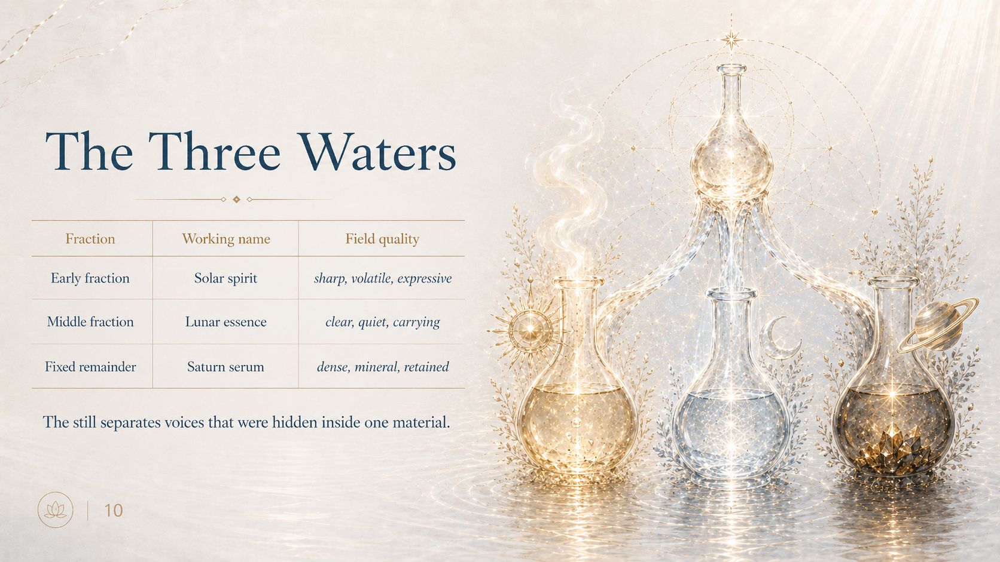

This slide begins the movement into the record itself.

The still does not receive neutral material. The starting material has already been shaped before it ever reaches the vessel.

It has been shaped by the body state: sleep, appetite, stress, cycle position, digestion, hydration, movement, rest, intimacy, and emotional field.

It has been shaped by time: morning, midday, evening, the age of the material, the season, the lunation, the point in the menstrual cycle, and the interval between collection, storage, distillation, and measurement.

It has also been shaped by handling: the jar, the lid, the air, the storage method, the aging interval, the heat behavior, the moment the fractions are separated, and the timing of the readings.

And then there is the observer.

The observer is not outside the record. The way I relate to the material changes what I notice. Aversion, reverence, curiosity, fear, ease, pleasure, precision, hesitation — all of these influence the quality of witnessing.

So this slide is important because it keeps the work honest.

The still shows something, but it does not show everything.

The record has to hold the whole field around the reading.

**Purpose of the slide**

This slide prevents the data from being treated as isolated numbers. It says: every reading belongs to a chain of conditions.

It also protects the work from becoming too mechanical. The still is part of the field, but so are the body, the room, the timing, the storage, and the observer.

### 12

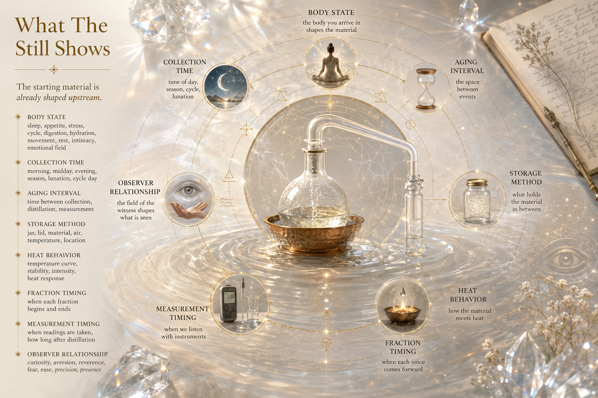

This is the first data slide.

I want to begin with something very simple: same body, same day, fresh raw material.

The early morning sample and the midday sample had almost the same pH. One was 5.2 and the other was 5.3. So if I were only watching pH, I might think very little had changed.

But the conductivity tells a different story.

The early morning sample read 3,570 microsiemens per centimeter. The midday sample read 13,590 microsiemens per centimeter. That is almost a fourfold change in concentration within the same day, from the same body.

The TDS reading followed the same direction, moving from 1,800 ppm to 6,850 ppm.

So the lesson here is not that one reading is better than the other.

The lesson is that the fluid is responsive. It is not static. It changes with timing, body state, intake, rhythm, and conditions upstream.

This is why the archive has to hold context.

A number without timing is incomplete.

**Purpose of the slide**

This slide introduces the measurement record through a clear, easy-to-understand contrast.

It shows that pH alone is not enough. The deeper story appeared in conductivity and TDS.

###  13

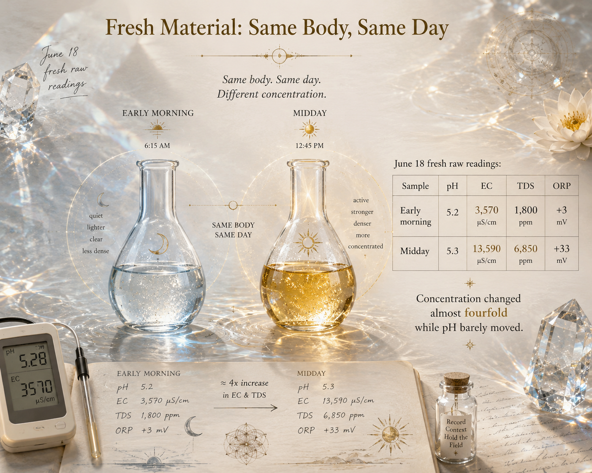

This slide marks a threshold in the archive.

June 13 was the first documented run where menstrual blood entered the material record.

For me, this mattered because the menstrual cycle had already been present as lived experience, rhythm, timing, body sensation, and symbolic intelligence. But on this day, it also entered the measurement archive.

The raw morning material read acidic, with a pH of 5.1. It was strongly conductive, with an EC of 10,690 microsiemens per centimeter. The ORP was positive, at +94 millivolts, and the H₂ reading was zero.

After distillation, the first distillate shifted strongly. The pH moved to 9.1. Conductivity dropped to 2,490 microsiemens per centimeter. ORP moved into the negative range, at −41 millivolts. H₂ appeared at 84 parts per billion.

The redistillate moved further in the same direction: pH 9.7, EC 915 microsiemens per centimeter, ORP −42 millivolts, and H₂ 88 parts per billion.

What matters here is not only the numbers.

What matters is that cycle material entered the field in a traceable way.

The menstrual cycle stopped being only a symbolic or phenomenological question. It became something I could begin to observe through repeated runs, timing, fraction behavior, and comparison.

This is still early. It is one documented threshold, not a conclusion.

But it opened the cycle question in the record.

**Purpose of the slide**

This slide brings together the feminine cycle material and the measurement archive. It shows the first moment where menstrual material becomes part of the recorded distillation inquiry.

The key point is not to overinterpret. The key point is:

A new variable entered the archive, and the readings changed across raw, distillate, and redistillate.

### 14

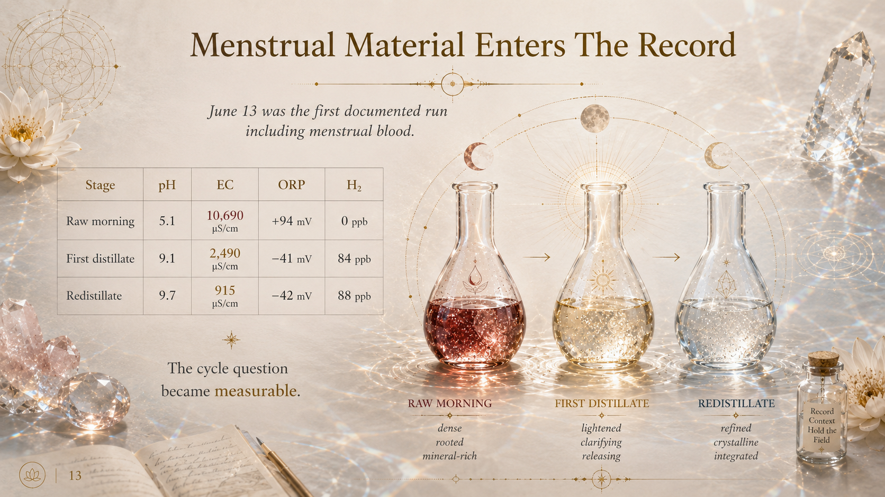

This slide is important because it shows the first place where repeatability begins to appear clearly.

On June 20, I ran two independent first-pass distillations from the same aged blend.

The spirit fractions were very close.

Spirit A read pH 10.0, EC 16.83 millisiemens per centimeter, ORP −94 millivolts, and H₂ 190 parts per billion.

Spirit B read pH 9.9, EC 15.07 millisiemens per centimeter, ORP −97 millivolts, and H₂ 198 parts per billion.

These are not identical readings, but they are close enough to matter. They suggest that the early volatile fraction from this aged material had a recognizable profile across two separate runs.

The essence fractions were also related, but less tightly matched. Both held a negative ORP of −58 millivolts, and both carried H₂ in a similar range: 124 and 118 parts per billion. But the conductivity differed more strongly, with Essence A at 1,368 microsiemens per centimeter and Essence B at 649 microsiemens per centimeter.

So the spirit repeated most clearly.

The essence stayed related, but more variable.

And the serum, which appears on the next slide, marked the dense edge of the process.

This is not enough to make a broad conclusion. But it is enough to say: something patterned appeared.

**Purpose of the slide**

This slide introduces the strongest evidence of pattern so far: two spirit cuts from the same aged source repeated closely.

The key distinction:

Spirit = tight repeatability
Essence = related but more variable
Serum = dense fixed edge, shown next

### 15

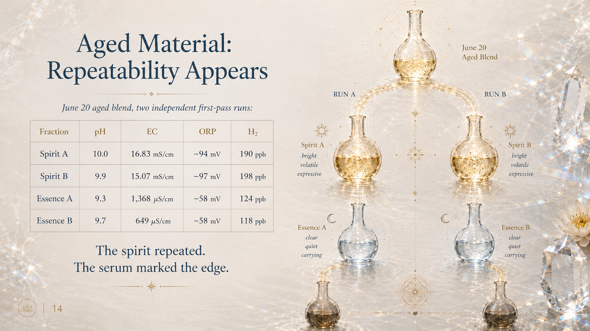

This slide shows the fixed edge of the aged material.

After the spirit and essence were separated, the serum remained. This was the dense remainder, the retained pole of the process.

The serum did not behave like the distillate fractions.

Its pH was much lower, at 6.1. Its conductivity was much higher, at 26.0 millisiemens per centimeter. Salinity read 12.9 parts per thousand. The ORP was positive, at +45 millivolts. And H₂ read zero.

So while the spirit and essence moved into alkaline, negative-ORP, hydrogen-present readings, the serum held the opposite pole: dense, conductive, mineral, retained, and oxidizing by comparison.

This is why I am calling it Saturn serum as a working name.

Not because the name explains it.

Because the name helps me remember its quality: fixed, heavy, mineral, remaining, boundary-forming.

In the archive, the serum matters because it shows what does not rise.

The distillate tells one part of the story.

The remainder tells another.

**Purpose of the slide**

This slide completes the three-fraction story from Slide 10 and the June 20 repeatability story from Slide 14.

It shows the contrast between:

volatile / rising / alkaline / negative ORP / H₂ present
and
fixed / retained / dense / conductive / positive ORP / H₂ absent

### 16

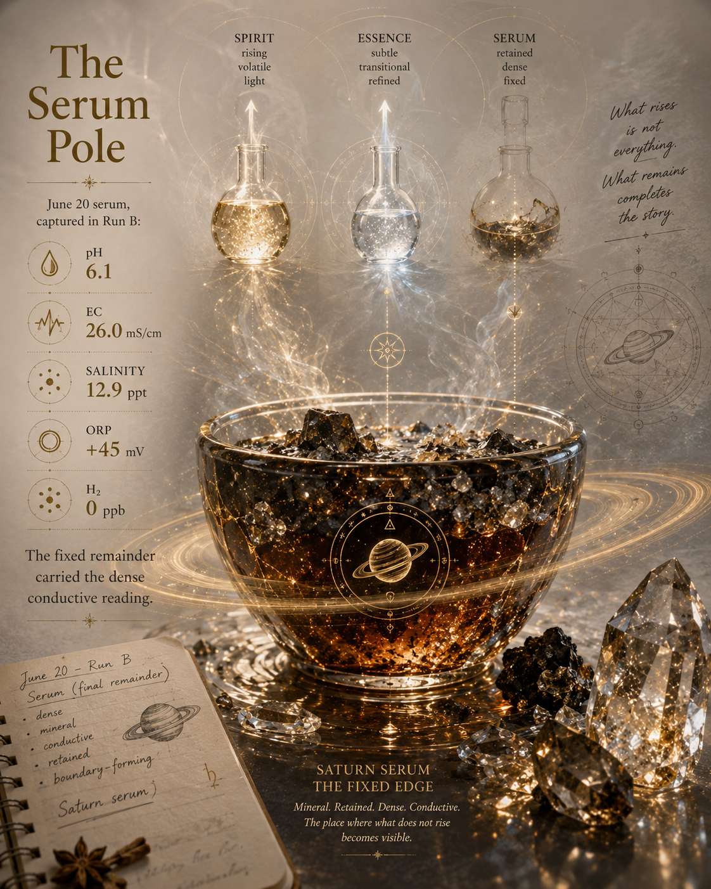

This slide gathers the observations without reaching beyond them.

So far, the record shows that fresh raw material can vary strongly within one day. The June 18 readings made that clear: the pH barely moved, but conductivity and TDS changed dramatically.

The record also shows that distillation has repeatedly shifted fresh material toward a different profile: more alkaline, lower conductivity, negative ORP, and measurable H₂ in the distillate.

The menstrual material opened a distinct cycle inquiry. It brought the womb cycle into the archive not only symbolically, but through timing, material, distillation behavior, and measurement.

The aged material has shown strong fraction differentiation. Spirit, essence, and serum did not behave as one uniform material. They separated into distinct qualities.

And on June 20, two aged spirit cuts from one bottle repeated closely. That is one of the strongest pattern signals so far.

This slide is not a conclusion.

It is a careful gathering.

It says: these are the things that have appeared more than once, or appeared strongly enough to deserve continued attention.

**Purpose of the slide**

This slide gives the audience a clean landing after the data-heavy section.

It prevents the presentation from feeling like scattered measurements by naming the emerging pattern:

fresh variation
distillation shift
cycle inquiry
fraction differentiation
early repeatability

### 17

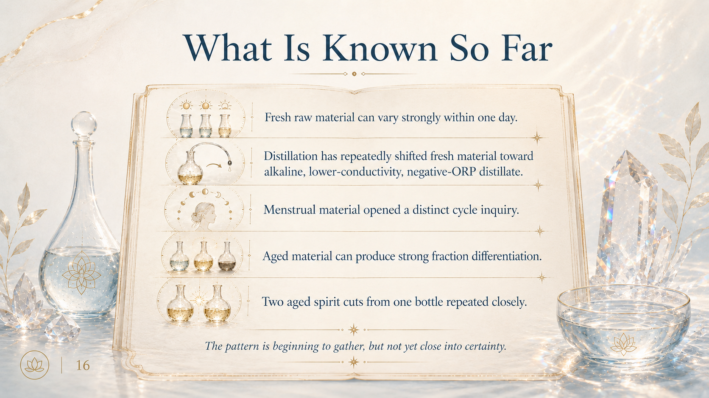

This slide is very important because it keeps the record clean.

After naming what has appeared so far, I also need to name what is not known.

I do not yet know which variables matter most in every run. It may be diet. It may be time of day. It may be cycle position. It may be aging interval. It may be heat behavior. It may be the way the material was stored, poured, separated, or measured.

I do not yet know how each cycle phase changes each fraction. The menstrual cycle has entered the archive, but the pattern is not yet mature.

I do not yet know how aging method changes the spirit. Aged material seems to behave differently from fresh material, but the method of aging itself needs to be watched more carefully.

I do not yet know whether serum profiles repeat across sources. The serum from June 20 was striking, but one serum reading is not enough.

And I do not yet know what belongs to the body, the jar, the room, and the meter.

This is the honest edge.

The meter gives a reading. The body gives a record. The archive learns how to hold both without confusing them.

This is why the work stays alive.

Not because it has already answered itself, but because the questions are becoming clearer.

**Purpose of the slide**

This slide builds trust. It makes the presentation stronger because it shows restraint.

It says: this is not a doctrine, not a conclusion, and not a performance of certainty. It is an active record.

The key line is:

The honest edge keeps the work alive.

### 18

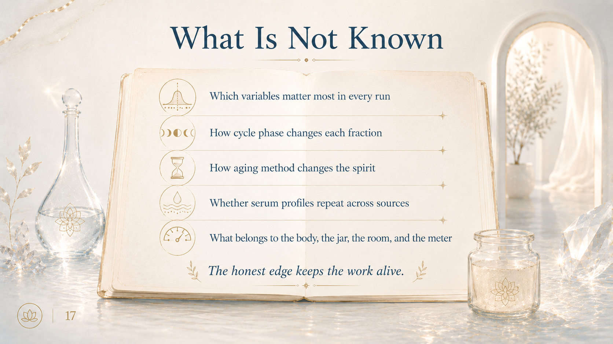

This slide widens the frame again.

After looking at individual readings, fractions, and specific dates, I want to return to time.

One run gives a reading. It tells me what appeared in that moment, under those conditions, from that body state, that material, that heat, and that measurement timing.

A month gives a pattern. It begins to show repetition, variation, cycle position, menstrual timing, food shifts, sleep, practice, stress, and environmental influence.

But a year gives the range.

A year allows the record to pass through seasons, through heat and cold, through different lands, through cycle changes, through travel, rest, intensity, lunar rhythm, solar rhythm, and daily life.

This is why the archive is chronological.

It is not only organized by sample type or measurement category. It is organized by lived time.

The record tracks chronology and cycle position together because the body is not happening outside time.

The body is a living year.

**Purpose of the slide**

This slide transitions out of the measurement section and into the larger archive.

It says: the point is not a single dramatic reading. The point is range over time.

The key movement:

run → month → year
reading → pattern → range

### 19

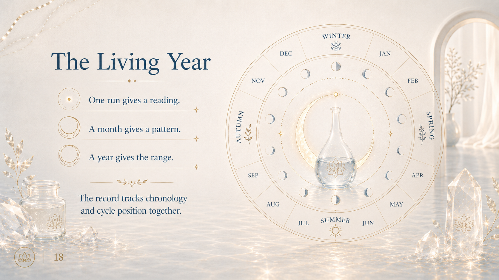

This slide shows what the archive is actually holding.

It is not only a spreadsheet of numbers.

It is a layered record.

The body layer holds sleep, appetite, cycle position, ease, fatigue, digestion, receptivity, and resistance.

The input layer holds what entered the body: diet, water, herbs, movement, rest, and daily rhythm.

The output layer holds what the body produced: volume, color, scent, foam, clarity, density, and readings.

The practice layer holds the way the material was met: breath, meditation, intimacy, ritual, topical use, oral use, cooking, distillation, or rest.

The distillation layer holds the technical record: source age, heat, timing, fractions, retentate, and measurement timing.

The phenomenology layer holds the inner record: mood, dreams, aversion, pleasure, hesitation, trust, clarity, grief, intensity, and receptivity.

And the environment layer holds the wider field: weather, travel, land, room, household, social contact, moon, season, and place.

This matters because the fluid is never separate from the life around it.

The archive has to be wide enough to hold the life.

**Purpose of the slide**

This slide explains the structure of the living archive. It shows that your record is not just “data,” but contextual field documentation.

The key message:

The archive has to be wide enough to hold the life.

### 20

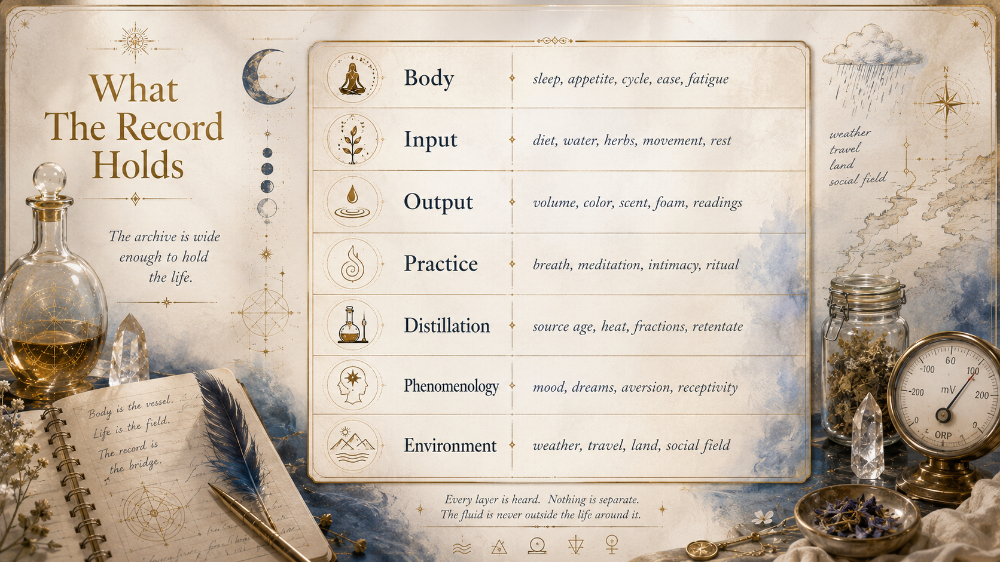

This slide brings us back to the room itself.

This work is private because the material is tender.

Not fragile, but tender.

It is easy for unusual body-based work to be corrected before it is heard. It is easy for the first response to be fear, disgust, diagnosis, warning, authority, dismissal, or instruction.

But a living record needs a different kind of room.

It needs a room where the body is allowed to speak before it is interpreted.

A room where observation is not immediately turned into a claim.

A room where women can say, “This is what I noticed,” without having to defend the entire territory of the body at once.

Private witness protects the material while the pattern gathers.

It allows the record to mature before it is exposed to distortion.

It allows the observer to stay close to the body, close to the material, close to the questions, and close to the truth of what has actually appeared.

This room matters because it is not here to correct the body.

It is here to listen carefully.

**Purpose of the slide**

This slide explains why the presentation is private. It is not secrecy for its own sake. It is protection of early-stage observation.

The key message:

A pattern needs a safe room before it can become a public language.

### 21

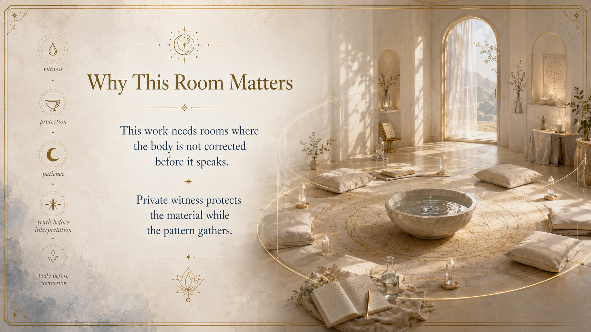

This slide opens the room.

After sharing the record, I do not want to close the presentation with a conclusion that asks everyone to agree with me.

I want to open a careful conversation.

The first question is: what part of the pattern feels familiar?

Not intellectually impressive. Not scientifically proven. Familiar.

Where has your own body already known separation and return? In digestion, bleeding, birth, grief, sweating, tears, milk, appetite, rest, healing, intimacy, fatigue, or change?

What kinds of observation feel trustworthy to you?

For some women, numbers may feel trustworthy. For others, timing, dreams, scent, cycle, mood, texture, or direct body sensation may speak more clearly. A careful record does not need to flatten these forms of knowing into one language. It can hold several kinds of observation beside one another.

And then the final question: what would a careful women’s record need to protect?

Privacy. Context. Consent. Tender material. Cycle timing. The right not to be corrected too soon. The right not to be forced into a medicalized frame before the body has spoken.

This slide is not about getting answers quickly.

It is about letting the room become part of the witness.

**Purpose of the slide**

This slide turns the presentation into a shared room without making the audience feel pressured to adopt the practice.

It invites reflection, not agreement.

The key movement is:

from presentation → witness → conversation

### 22

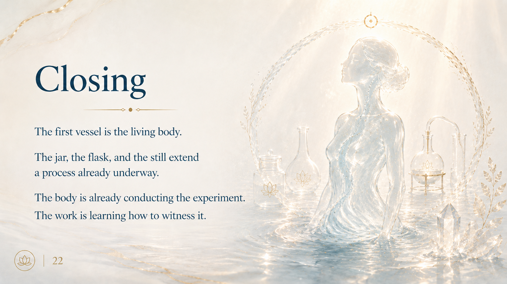

This is where I want to close.

Not with certainty, and not with a claim.

I want to close by returning to the beginning.

The first vessel is the living body.

Before the jar, before the flask, before the still, the body was already receiving, separating, concentrating, transforming, returning, and recording.

The still extends that process. It does not replace the body’s intelligence. It gives one edge of the process a visible form.

So this work is not about making the body into an object.

It is about learning how to stay close enough to witness what the body is already doing.

The body is already conducting the experiment.

The work is learning how to witness it.

**Purpose of the slide**

This slide closes the loop with Slide 2 and Slide 3.

It returns to the core thesis:

The body distills first.
The still gives the process a visible edge.
The practice is witness, not claim.

### 

